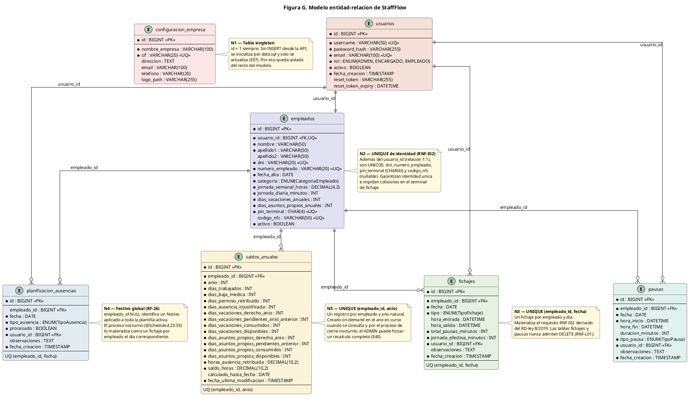
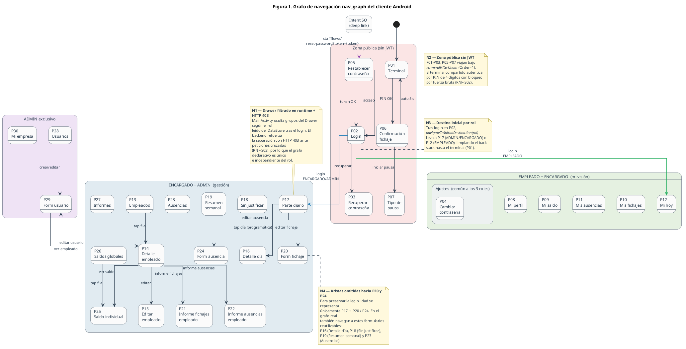

# StaffFlow — Decisiones de diseño y su porqué

Este documento es el registro, mantenido por el autor del proyecto, de las
decisiones de diseño de StaffFlow que tienen una justificación de negocio o
legal detrás. Complementa al [informe técnico](informe-tecnico.md), que
describe la arquitectura y el funcionamiento del sistema, y al
[catálogo de la API](api.md), que recoge los endpoints y las pantallas. Las
nueve decisiones de arquitectura (ADR) se recogen al final de este documento.

Cada entrada sigue el mismo patrón: **qué se decidió → por qué → dónde vive
en el código → cómo evoluciona**. Las referencias al código señalan clases,
métodos y campos concretos del repositorio para que puedan localizarse con
una búsqueda de símbolo.

## Índice por tema

**Identidad y roles**

- [4. El ADMIN no ficha: identidad de acceso ≠ identidad laboral](#4-el-admin-no-ficha-identidad-de-acceso--identidad-laboral)
- [5. Alta conjunta usuario + empleado (con la excepción ADMIN)](#5-alta-conjunta-usuario--empleado-con-la-excepción-admin)
- [15. Categoría ≠ Rol: qué hace vs. qué puede hacer](#15-categoría--rol-qué-hace-vs-qué-puede-hacer)
- [19. `terminal_service`: autoría técnica sin sesión](#19-terminal_service-autoría-técnica-sin-sesión)

**Seguridad y credenciales**

- [2. JWT de 12 horas dimensionado por la jornada partida](#2-jwt-de-12-horas-dimensionado-por-la-jornada-partida)
- [7. PINs aleatorios, únicos, y visibles una sola vez](#7-pins-aleatorios-únicos-y-visibles-una-sola-vez)
- [8. Visibilidad del PIN por campo, no por endpoint ("Opción A")](#8-visibilidad-del-pin-por-campo-no-por-endpoint-opción-a)
- [13. Recuperación de contraseña sin filtrar información](#13-recuperación-de-contraseña-sin-filtrar-información)
- [20. Bloqueo del terminal por dispositivo, no por empleado](#20-bloqueo-del-terminal-por-dispositivo-no-por-empleado)

**Tiempo y cumplimiento legal**

- [3. Redondeo asimétrico siempre a favor del empleado](#3-redondeo-asimétrico-siempre-a-favor-del-empleado)
- [6. Permisos temporales por legalidad laboral](#6-permisos-temporales-por-legalidad-laboral)
- [9. Cierre nocturno a las 23:55: ningún día termina indefinido](#9-cierre-nocturno-a-las-2355-ningún-día-termina-indefinido)
- [18. Prorrateo de vacaciones redondeado al alza](#18-prorrateo-de-vacaciones-redondeado-al-alza)

**Dominio y datos**

- [10. Semana fija L-V: corte de alcance consciente](#10-semana-fija-l-v-corte-de-alcance-consciente)
- [11. Alta diferida: existir en el sistema ≠ empezar a trabajar](#11-alta-diferida-existir-en-el-sistema--empezar-a-trabajar)
- [12. Deshabilitación reversible: excedencias sin corromper saldos](#12-deshabilitación-reversible-excedencias-sin-corromper-saldos)
- [14. Las pausas retribuidas no descuentan jornada](#14-las-pausas-retribuidas-no-descuentan-jornada)
- [16. Ausencias: un registro por día, nunca rangos en la base](#16-ausencias-un-registro-por-día-nunca-rangos-en-la-base)
- [17. Festivo global = FK nullable como polimorfismo de negocio](#17-festivo-global--fk-nullable-como-polimorfismo-de-negocio)

**Terminal y experiencia de kiosco**

- [1. NFC como método principal, PIN como alternativa económica](#1-nfc-como-método-principal-pin-como-alternativa-económica)
- [21. "La tablet es el usuario": decisiones de UX de kiosco](#21-la-tablet-es-el-usuario-decisiones-de-ux-de-kiosco)

Cierran el documento las [decisiones menores](#decisiones-menores), las
[notas de ingeniería](#notas-de-ingeniería), las
[decisiones de arquitectura (ADR 1–9)](#decisiones-de-arquitectura-adr) y
[el hilo conductor](#el-hilo-conductor).

## Leyenda de códigos

| Código | Significado |
|---|---|
| **E01–E68** | Identificador de endpoint REST (por ejemplo, E01 = `POST /api/v1/auth/login`). Catálogo completo en [`api.md`](api.md). |
| **P01–P30** | Identificador de pantalla Android. Catálogo en [`api.md`](api.md#catálogo-de-pantallas-android-p01-p30). |
| **RF-nn** | Requisito funcional: una capacidad concreta que el sistema debe ofrecer. |
| **RNF-Xnn** | Requisito no funcional; la letra indica la familia: **S** seguridad, **L** legal (RD-ley 8/2019), **I** integridad de datos. |
| **M-nnn** | Mejora o gap registrado para v2 (por ejemplo, M-042). |
| **ADR n** | Decisión de arquitectura, numerada según la sección [Decisiones de arquitectura](#decisiones-de-arquitectura-adr) de este documento. |

---

## 1. NFC como método principal, PIN como alternativa económica

El diseño contempla la tarjeta NFC como método principal de fichaje; el PIN
de 4 dígitos es la alternativa económica (no requiere lectores ni tarjetas) y
el respaldo ante pérdida de la tarjeta.

- v1 implementa solo PIN; el campo `Empleado.codigoNfc` ya está modelado
  (columna `codigo_nfc`, UNIQUE, nullable) y `EmpleadoService` valida su
  unicidad en alta (`existsByCodigoNfc`) y en edición
  (`existsByCodigoNfcAndIdNot`).
- El fichaje NFC de v2 no necesitará migración de esquema: se anticipó el
  dato, que es barato de añadir ahora y caro de añadir después, sin construir
  la lógica, que es cara y podía esperar. Es una decisión deliberada de no
  sobredimensionar la primera versión.

## 2. JWT de 12 horas dimensionado por la jornada partida

La validez del token (43.200.000 ms) no es un valor tomado de un ejemplo
genérico: cubre una jornada partida española (8 h de trabajo más una pausa de
comida de hasta 4 h) sin forzar un nuevo inicio de sesión a mitad de turno.

- Documentado en las tres configuraciones (`application.yaml`,
  `application-dev.yml`, `application-mysql.yml`) bajo la clave
  `jwt.expiration-ms`: *"12h cubre una jornada laboral con descanso de
  comida"*. La misma justificación aparece en el Javadoc de
  `JwtTokenProvider`.
- Evolución v2 (roadmap 2.4): access token corto más refresh token, para
  reducir la ventana de exposición.

## 3. Redondeo asimétrico siempre a favor del empleado

La jornada efectiva se redondea hacia arriba (`Math.ceil`) y la duración de
las pausas hacia abajo (`Math.floor`). Ambas asimetrías favorecen al
empleado, una posición defendible ante cualquier inspección o conflicto
laboral.

- En el código: `TerminalService.registrarSalida()` calcula
  `Fichaje.jornadaEfectivaMinutos` con `Math.ceil`;
  `TerminalService.finalizarPausa()` y `PausaService.cerrar()` calculan
  `Pausa.duracionMinutos` con `Math.floor`. Los comentarios de ambas
  entidades dejan constancia del motivo ("beneficia al empleado").

## 4. El ADMIN no ficha: identidad de acceso ≠ identidad laboral

El ADMIN gestiona la aplicación y no tiene ficha de empleado: sus
credenciales son de gestión, no de presencia. Fichan los empleados; el
ENCARGADO tiene ambas identidades (gestiona y ficha).

- Materializado en la separación de tablas `usuarios` / `empleados` (ADR 2)
  y en el guard de transición de roles de `UsuarioService.actualizar()`
  (E11): un ADMIN puro no puede pasar a un rol con ficha ni viceversa.

*Modelo entidad-relación: `usuarios` y `empleados` son tablas distintas
unidas por una relación opcional; el resto del modelo (fichajes, pausas,
planificación de ausencias, saldos) cuelga de `empleados`.*

## 5. Alta conjunta usuario + empleado (con la excepción ADMIN)

La app no permite crear un usuario de rol no-ADMIN sin dar de alta su ficha
de empleado en el mismo formulario: `FormUsuarioViewModel.crear()` valida
todos los campos del perfil laboral antes de realizar ninguna llamada.

- A nivel de API es un contrato en dos pasos (E08 → E13), no una transacción
  atómica. Si E13 falla (por ejemplo, DNI duplicado), el usuario queda sin
  ficha; el guard de E11 usa la existencia de empleado como fuente de
  verdad. Mejora natural para v2: un endpoint compuesto transaccional.

## 6. Permisos temporales por legalidad laboral

El ENCARGADO opera el presente y planifica el futuro: solo puede gestionar
fichajes y pausas de hoy (antes del cierre) y ausencias de hoy en adelante.
El ADMIN es el único que puede corregir el pasado, y lo hace auditado
(observaciones obligatorias y autor no nulo).

- Porqué: los registros ya ocurridos son el documento que exige el RD-ley
  8/2019; cuanta menos gente pueda tocarlos, más defendible es el registro.
- Aplicado en la capa de servicio (`FichajeService.crear()`,
  `PausaService.crear()` y `cerrar()`, `AusenciaService.crear()`)
  comparando la fecha del request con la fecha del servidor obtenida del bean
  `Clock`, nunca con una fecha enviada por el cliente. Los grids HTML además
  no pintan como editables las celdas prohibidas: defensa en profundidad.

## 7. PINs aleatorios, únicos, y visibles una sola vez

- Generación en `EmpleadoService.generarPinUnico()` con `SecureRandom` (no
  `Random`), en un bucle contra `EmpleadoRepository.existsByPinTerminal()`
  y con UNIQUE en base de datos como red de seguridad. El propio Javadoc
  documenta el límite: por encima de 9.000 empleados el bucle se degrada.
- La unicidad global es funcional, no solo de seguridad: en el terminal el
  PIN es identificador y credencial a la vez (no se teclea usuario).
- Al generar o regenerar el PIN (E13 / E65) aparece una sola vez en pantalla
  para entregarlo al empleado; no se puede volver a consultar por esa vía.
  Regenerar pueden ADMIN y ENCARGADO (en la operativa real el encargado es
  quien está en el local); consultar, solo el ADMIN.

## 8. Visibilidad del PIN por campo, no por endpoint ("Opción A")

El mismo endpoint E15 devuelve payloads distintos según el rol: el ADMIN
recibe `pinTerminal`, `email`, `username` y `rol`; el ENCARGADO recibe null
en los cuatro (`EmpleadoService.obtenerPorId()`). Ningún listado expone el
PIN.

- La asimetría regenerar-sí / consultar-no es el patrón de helpdesk de
  contraseñas: resetear es un evento visible que invalida la credencial
  anterior; leer sería un acceso silencioso. Por eso el privilegio de lectura
  es más estricto que el de reseteo.

## 9. Cierre nocturno a las 23:55: ningún día termina indefinido

El cierre nocturno (`ProcesoCierreDiario.ejecutar()`, programado con cron
`0 55 23 * * *`) finaliza el día automáticamente y actualiza los saldos:
quien no tiene fichaje ni ausencia recibe `AUSENCIA_INJUSTIFICADA` (día
laborable) o `DIA_LIBRE` (fin de semana). Es automático para garantizar el
cálculo de saldos.

- Cerrar antes de medianoche crea el registro dentro del día que documenta:
  a las 00:00 todo empleado tiene su registro diario, que es el invariante
  que exige el RD-ley 8/2019.
- El orden interno es intencionado: A (cerrar día) → B (materializar
  planificaciones) → C (recalcular saldos), para que los saldos incluyan la
  penalización recién creada.
- "Solo el ADMIN puede quitar una ausencia injustificada" no está
  programado: emerge de componer el cierre de las 23:55 con la regla temporal
  de la decisión 6. Al día siguiente ya es pasado, y el pasado es solo del
  ADMIN.
- Matiz conocido: entre las 23:55 y las 00:00 el ENCARGADO aún puede editar
  "hoy". Es benigno: la corrección es legítima y el siguiente cierre, que es
  idempotente, recalcula.

## 10. Semana fija L-V: corte de alcance consciente

v1 asume de lunes a viernes laborables y sábado y domingo siempre libres.
Modelar turnos habría duplicado el alcance.

- La suposición vive en puntos conocidos: el divisor `/ 5.0` con el que
  `EmpleadoService.crear()` deriva la jornada diaria de la semanal, y la
  bifurcación laborable/fin de semana de `ProcesoCierreDiario.ejecutar()`
  (con siembra anticipada de `DIA_LIBRE` para el fin de semana).
- El roadmap 2.2 (planificación de horarios) es el reemplazo documentado,
  marcado como prerrequisito de 2.1 y 2.3. Fue gestión de alcance, no falta
  de tiempo: el Gantt real pasó de 225 h estimadas a 340 h y el proyecto se
  entregó en plazo.

## 11. Alta diferida: existir en el sistema ≠ empezar a trabajar

Se puede dar de alta hoy a quien empieza el mes que viene: `fechaAlta`
acepta hoy o una fecha futura y rechaza el pasado con 400
(`EmpleadoService.crear()`), por coherencia con el prorrateo de saldos.

- El prorrateo de vacaciones cuenta desde la `fechaAlta` real.
- El parte diario y el cierre nocturno solo consideran empleados con
  `fechaAlta <= fecha` (`ProcesoCierreDiario.ejecutar()` usa
  `findByActivoTrueAndFechaAltaLessThanEqual`): el contratado del lunes no
  recibe una ausencia injustificada el viernes anterior.
- El alta es una operación exclusiva del ADMIN, tanto en el flujo de la app
  (P29 → E08 → E13) como en la API: `EmpleadoController.crear()` (E13) está
  protegido con `@PreAuthorize("hasRole('ADMIN')")`. En la versión entregada
  E13 admitía también al ENCARGADO; la revisión posterior a la entrega lo
  restringió al ADMIN en el controller, en el test de seguridad estructural y
  en la especificación `openspec/specs/security-authorization`.

## 12. Deshabilitación reversible: excedencias sin corromper saldos

Usuarios y empleados nunca se borran: se deshabilitan y pueden rehabilitarse
(baja de larga duración, excedencia). Un solo flag `activo` produce cuatro
efectos coherentes: el cierre nocturno lo ignora (sin acumular injustificadas
durante la excedencia, porque las tres tareas de
`ProcesoCierreDiario.ejecutar()` iteran solo sobre activos), queda fuera del
recálculo de saldos, sale del parte diario y pierde acceso al terminal.

- El detalle clave: **excluido del cálculo, incluido en la consulta**.
  `SaldoService.obtenerPorEmpleado()` no filtra por activo en lecturas ("un
  empleado inactivo puede tener saldo histórico válido consultable"): el
  historial sigue disponible, como exige la retención de cuatro años. La
  línea entre cálculo y consulta está trazada exactamente donde la legalidad
  lo requiere.

## 13. Recuperación de contraseña sin filtrar información

En el login, "¿Olvidaste tu contraseña?" pide el email del usuario y envía
una contraseña temporal de 8 caracteres (`SecureRandom` sobre un alfabeto sin
caracteres ambiguos, hash BCrypt, envío SMTP asíncrono;
`AuthService.solicitarRecuperacion()`, E04). El usuario entra y la cambia
desde el menú (E03, que exige la contraseña actual).

- **Anti-enumeración (RNF-S04) en tres capas**: el backend devuelve el mismo
  200 exista o no el email; la app muestra siempre la misma confirmación; y
  el propio texto está redactado en condicional: *"Si el email está
  registrado recibirás un correo…"* (recurso `recovery_confirmacion_mensaje`
  de `strings.xml`), sin afirmar nunca si la dirección pertenece a una
  cuenta. El texto de la interfaz actúa como control de seguridad, alineado
  con las guías OWASP para este flujo.
- **Andamiaje v2 deliberado**: E05 (`AuthService.restablecerPassword()`,
  `/password/reset`) existe y siempre devuelve 400 en v1; los campos
  `Usuario.resetToken` y `Usuario.resetTokenExpiry` están en la entidad pero
  E04 nunca los escribe; la pantalla P05 ya está construida con su deep link
  `staffflow://reset-password?token=` registrado en el nav graph. Es el
  mismo patrón que el NFC: el dato y la interfaz anticipados, la
  funcionalidad en v2.
- **Evolución prevista (roadmap 2.8)**: sustituir la contraseña temporal por
  un enlace de restablecimiento. El trabajo de v2 es solo el eslabón central
  (E04 genera y persiste el token; E05 lo valida, lo consume y lo invalida),
  sin migración de esquema, sin pantalla nueva y sin cambio de navegación.
  El beneficio real en seguridad: la contraseña temporal es una credencial
  válida que permanece en la bandeja de entrada por tiempo indefinido; el
  token es de un solo uso y expira en 30 minutos. La ventana de ataque pasa
  de indefinida a media hora, y usarlo lo destruye.

## 14. Las pausas retribuidas no descuentan jornada

Una pausa de tipo `AUSENCIA_RETRIBUIDA` (gestión médica, trámites oficiales)
es tiempo pagado: no resta de la jornada efectiva (RF-35;
`PausaService.cerrar()` solo actualiza el fichaje del día cuando el tipo no
es `AUSENCIA_RETRIBUIDA`). El enum incluso se renombró desde `PERSONAL`
*"para describir con mayor precisión el concepto laboral"* (Javadoc de
`TipoPausa`): el vocabulario del código siguió al del dominio, no al revés.

## 15. Categoría ≠ Rol: qué hace vs. qué puede hacer

`CategoriaEmpleado` es informativa, nunca autorización. La alternativa está
descartada por escrito en el Javadoc del enum: *"usar la categoría para
determinar permisos duplicaría la lógica de autorización ya resuelta por
Spring Security con Rol"*. Un encargado de equipo puede tener rol EMPLEADO y
un técnico rol ENCARGADO: son dimensiones independientes.

## 16. Ausencias: un registro por día, nunca rangos en la base

El modelo de rango (fechaInicio/fechaFin) *"fue descartado por complicar
innecesariamente el proceso nocturno"* (comentario sobre
`PlanificacionAusencia.fecha`). E63 (rango) es azúcar de API sobre los
mismos registros por día. En caso de conflicto se devuelve 409 con la
**lista de fechas conflictivas** (`RangoConflictException.getFechasConflictivas()`)
para que la app pregunte "¿Sobrescribir?"; los días ya materializados
(`procesado = true`) son inmutables y devuelven 400 sin excepción.

## 17. Festivo global = FK nullable como polimorfismo de negocio

`empleadoId` nulo significa "festivo para toda la plantilla activa"; con
valor, ausencia individual (RF-26; `AusenciaRequest.empleadoId` y la
relación `PlanificacionAusencia.empleado` con `nullable = true`). Un solo
registro modela el festivo nacional sin duplicar filas por empleado.

## 18. Prorrateo de vacaciones redondeado al alza

Compañera de la decisión 3 (redondeos): los días de vacaciones prorrateados
por fecha de alta usan `ceil` *"para que el empleado no pierda fracción de
día"* (`SaldoService.crearSaldoInicial()`). Esta coherencia es el motivo
declarado de que las altas retroactivas se rechacen (decisión 11).

## 19. `terminal_service`: autoría técnica sin sesión

La trazabilidad legal exige `usuario_id NOT NULL` en fichajes y pausas
(RNF-L01), pero el terminal no tiene sesión JWT y el cierre nocturno
tampoco. Solución: el usuario de sistema `terminal_service` firma esos
registros (`TerminalService.obtenerUsuarioSistema()` y
`ProcesoCierreDiario.ejecutar()`), buscado **por username y no por id**
*"para no depender del autoincremental de BD, que puede diferir entre dev y
prod"*. Se distingue así el autor técnico (quién escribió la fila) del
decisor humano (quién ordenó el cambio, en `observaciones`). Gap conocido y
registrado (M-042): una desactivación accidental de ese usuario dejaría sin
autor al proceso, y si la fila falta o se renombra el cierre nocturno falla
con rollback completo.

## 20. Bloqueo del terminal por dispositivo, no por empleado

Tras 5 PINs fallidos (`TerminalService.MAX_INTENTOS`) se bloquea el
**dispositivo**, no una cuenta (`TerminalService.verificarBloqueo()`): protege
el kiosco compartido sin castigar a un empleado concreto por los errores de
otros. Se eligió HTTP **423 Locked** por su semántica ("el recurso está
bloqueado") en vez de 403 o 429. El propio código documenta la limitación:
el contador vive en memoria (`ConcurrentHashMap`) y se pierde al reiniciar;
v2 lo persiste (roadmap 2.5). La revisión posterior a la entrega añadió una
segunda debilidad, todavía abierta: la clave `TerminalPinRequest.dispositivoId`
la elige el cliente, por lo que rotar el identificador reinicia el contador.
Su mitigación queda junto con la persistencia.

## 21. "La tablet es el usuario": decisiones de UX de kiosco

Tres decisiones de Android que componen la misma idea:

- El terminal (P01) es la pantalla de inicio **aunque exista sesión JWT
  restaurada**: una tablet compartida nunca arranca en los datos del último
  usuario que inició sesión (`MainActivity.checkExistingSession()` restaura
  el token pero no navega al destino del rol).
- `SessionManager.clear()` **preserva la URL del backend**: es configuración
  del dispositivo, no de la sesión del usuario (la clave `BASE_URL` se
  conserva intencionadamente).
- El teclado PIN **no tiene botón de confirmar**: el cuarto dígito dispara la
  verificación (`TerminalViewModel.appendDigito()` invoca `verificarPin()`
  al alcanzar la longitud 4, E52). Mínimo de toques para quien ficha con
  prisa.

*Grafo de navegación: el terminal PIN (P01) es el destino de arranque; el
login y las pantallas de gestión cuelgan de él, nunca al revés.*

---

## Decisiones menores

Decisiones de menor peso de negocio, verificadas en el código. Donde el
propio código deja constancia del motivo, se recoge; donde no, se describe
solo el comportamiento.

- **Anti-enumeración también en el login**: un usuario desactivado recibe el
  mismo error que un usuario inexistente
  (`UserDetailsServiceImpl.loadUserByUsername()`), y el mensaje no revela si
  falló el usuario o la contraseña (RNF-S04).
- **`MensajeResponse` en vez de HTTP 204**: las operaciones de confirmación
  devuelven un cuerpo con el texto del mensaje, de modo que la app muestra el
  snackbar sin mensajes fijados en el cliente.
- **El listado de empleados incluye inactivos por defecto** (E14, filtro
  `activo` opcional): la pantalla P13 necesita mostrarlos para que el ADMIN
  pueda reactivarlos.
- **POST (no PATCH) para recalcular saldos**: PATCH se reserva para cambios
  parciales; recalcular regenera el registro completo
  (`SaldoService.recalcular()`).
- **Validación preventiva de unicidad** (`existsBy...`) en vez de dejar que
  falle la restricción de base de datos: el 409 llega con el campo concreto
  en conflicto.
- **`GET /empresa` devuelve 404, no un objeto vacío**
  (`EmpresaService.obtenerEmpresa()`): *"un GET que devuelve datos vacíos sin
  error dificulta detectar que el sistema no está configurado"*.
- **Saldos bajo demanda solo del año actual**: evita filas vacías de años sin
  actividad y el 404 previo al primer cierre del año.
- **401 de `/auth/login` ≠ sesión caducada**: el interceptor
  `NetworkModule.authInterceptor` no emite `SessionExpired` cuando el 401
  procede del login, porque ahí significa credenciales incorrectas.
- **Silencio deliberado en la cabecera informativa** del formulario de
  usuario (`FormUsuarioViewModel.cargarCabeceraEmpleado()`): un 404 es el
  caso esperado para usuarios sin empleado vinculado y no debe romper el
  flujo.

## Notas de ingeniería

Decisiones de corte puramente técnico, documentadas en el código:

- Heurística del asterisco de "intervención manual" en informes
  (`InformeService.construirDiaConFichaje()`, M-007 y M-008), con su
  limitación documentada: no puede saber qué hora concreta se editó, así
  que marca entrada y salida cuando el fichaje completo fue manual.
- N+1 acotado y aceptado a conciencia: los `count()` adicionales por saldo
  son *"aceptables para volúmenes PYME"* (Javadoc de `SaldoService`). Deuda
  técnica elegida, no ignorada.
- Rutas `/me` declaradas antes de `/{id}` como convención de todo el
  proyecto, para que Spring no interprete "me" como un `Long` (Javadoc de
  `SaldoController`, aplicado también en `EmpleadoController`,
  `FichajeController`, `AusenciaController` y `PresenciaController`).
- `EstadoPresencia` como enum en el DTO, con la alternativa `String`
  descartada por escrito en su Javadoc: pierde tipado y aumenta el riesgo de
  valores inconsistentes entre servicio y cliente.
- BCrypt frente a MD5/SHA sin sal, justificado en
  `SecurityConfig.passwordEncoder()` (RNF-S01); firma HMAC-SHA frente a
  RS256, justificada en el Javadoc de `JwtTokenProvider` (una API monolítica
  genera y valida sus propios tokens).
- Reutilización "Opción C": `PdfService` delega la construcción de datos en
  los métodos públicos de `InformeService` para no duplicar `construirDias()`
  ni `calcularResumen()`.
- Idempotencia declarada del cierre nocturno (Javadoc de
  `ProcesoCierreDiario`): una segunda ejecución el mismo día no genera
  duplicados porque comprueba la existencia del fichaje antes de crearlo y
  `procesado = true` evita reprocesar planificaciones.

---

## Decisiones de arquitectura (ADR)

Decisiones estructurales del sistema, numeradas ADR 1–9. Se citan desde el informe técnico y desde las decisiones anteriores; a diferencia de aquellas, su justificación es principalmente técnica.

### ADR 1. API REST desacoplada del cliente Android

La lógica de negocio reside íntegramente en el backend. La app Android solo consume la API REST. Esto permite añadir en el futuro otros clientes (web o escritorio) sin modificar el núcleo del sistema.

### ADR 2. Separación entre usuarios y empleados

El modelo distingue entre `usuarios` (autenticación y rol) y `empleados` (perfil laboral). Un ADMIN tiene registro en `usuarios` pero no en `empleados`, ya que no tiene jornada laboral que registrar. ENCARGADO y EMPLEADO tienen registro en ambas tablas.

### ADR 3. Bajas lógicas en lugar de borrado físico

Usuarios y empleados se desactivan con `activo = false`. El historial queda intacto y la integridad referencial se preserva. Fichajes y pausas nunca se eliminan (cumplimiento RD‑ley 8/2019): los errores se corrigen mediante modificación con campo `observaciones` obligatorio.

### ADR 4. Terminal de fichaje con PIN separado del flujo JWT

Los 5 endpoints públicos de terminal (`/api/v1/terminal/entrada`, `/salida`, `/pausa/iniciar`, `/pausa/finalizar`, `/estado` — E48 a E52) no requieren JWT. Se identifican por PIN de 4 dígitos con bloqueo por fuerza bruta por dispositivo. Los 2 endpoints de gestión del bloqueo (`/terminal/bloqueo` GET y DELETE — E53 y E54) sí requieren JWT con rol ADMIN o ENCARGADO. El resto de la API (historial, saldos, perfil) requiere siempre JWT, garantizando que un PIN conocido por un compañero no permite acceder a datos personales.

### ADR 5. Single Activity + Navigation Component en Android

La app Android usa una única `MainActivity` con `NavHostFragment`. Cada pantalla es un `Fragment`. Navigation Component gestiona el back stack automáticamente desde `nav_graph.xml`. El Navigation Drawer vive en `MainActivity` con un menú XML único, y los grupos visibles (`group_empleado`, `group_encargado`, `group_admin`, `group_ajustes`) se muestran u ocultan según el rol del JWT mediante `menu.setGroupVisible(...)`.

### ADR 6. Estrategia de reutilización de Fragments en Android

Las 30 pantallas de la app Android se organizan en 6 bloques funcionales por rol con numeración continua P01–P30 sin huecos. Al planificar el desarrollo se identificaron grupos de pantallas con comportamiento visual y estructural similar, y se decidió implementarlas reutilizando un mismo patrón de Fragment cambiando solo el endpoint que invocan o el modo de operación.

Concretamente:

- El formulario de login (P02) sirvió de base para P03 (recuperación), P04 (cambio de contraseña) y P05 (reset por deep link): mismo layout de campo + botón + estado de carga.
- Las pantallas con WebView de informe (P10, P11, P19, P23, P26, P27) comparten el mismo esqueleto: barra de filtros, WebView que renderiza HTML servido por el backend y acciones de imprimir o abrir el PDF.
- P21 y P22 reutilizan literalmente los layouts de P10/P11 cambiando solo el endpoint: ven el informe individual de un empleado concreto en lugar del propio.

Esta estrategia redujo el tiempo estimado de implementación de las pantallas Android de ~60–70 horas a ~30 horas sin impacto visible para el usuario.

La tabla completa de las 30 pantallas (Fragment, bloque, endpoints principales y roles) está en el [catálogo de la API](api.md#catálogo-de-pantallas-android-p01-p30).

### ADR 7. Auto-detección de la URL del backend en Android

En el primer arranque la app sondea exactamente dos hosts en orden fijo —`10.0.2.2` (loopback del emulador Android Studio hacia el host) y `127.0.0.1` (demo standalone con backend en la misma tablet)—, ambos contra el puerto 8080, usando el endpoint público `GET /api/health` (E56) como prueba de vida. El primero que responde 200 OK fija la `baseUrl` y elimina la necesidad de configurar la URL manualmente. La dirección detectada se persiste en `DataStore` y sobrevive a los cierres de sesión (`SessionManager.clear()` la preserva intencionalmente). Si la detección automática falla, la app muestra un diálogo de recuperación ("No se pudo conectar al servidor") en el que el usuario introduce la IP del servidor; la URL se construye con esquema y puerto fijos (`http://<ip>:8080/api/v1/`) y se guarda en `DataStore`. No existe una pantalla de ajustes permanente para cambiarla después; esta limitación se aborda en el apartado 2.12 del roadmap.

### ADR 8. Cierre nocturno automático como única tarea programada

`ProcesoCierreDiario` se ejecuta cada noche a las 23:55 mediante `@Scheduled(cron = "0 55 23 * * *")` y es el único proceso automático del sistema. Es transaccional e idempotente: tres tareas encadenadas y un bloque salvaguarda intermedio, todos en una única transacción que se puede repetir sobre la misma fecha sin duplicar datos. Las tres tareas operan únicamente sobre empleados operativos esa noche (`activo = true` AND `fechaAlta <= hoy`); los empleados con alta diferida quedan fuera hasta su primer día de trabajo. La **Tarea A** cierra el día creando `AUSENCIA_INJUSTIFICADA` (laborables) o `DIA_LIBRE` (fines de semana) para todo empleado operativo sin fichaje. La **Tarea B** materializa las planificaciones con fecha ≤ mañana, lo que permite generar los festivos globales la noche anterior. A continuación, un **bloque salvaguarda** independiente (no es parte de Tarea B) deja sembrado el `DIA_LIBRE` del sábado o domingo siguientes cuando mañana cae en fin de semana, garantizando el descanso semanal obligatorio aunque no exista planificación previa. Finalmente, la **Tarea C** recalcula los saldos anuales llamando a `SaldoService.recalcularParaProceso`. Todos los fichajes auto-generados llevan `usuario_id = terminal_service` (autor técnico); el `usuario_id` de la planificación original conserva al humano que la decidió. La descomposición completa de las tres tareas y la contribución de cada `TipoFichaje` al recálculo de saldo está documentada en el [informe técnico, §6.5](informe-tecnico.md#65-el-cierre-nocturno-procesocierrediario).

### ADR 9. Convenciones de naming de identificadores humanos

El sistema usa dos identificadores legibles para personas con convenciones deliberadamente distintas:

- `username` (campo de login): lowercase, sin separador, prefijo según rol. `admin001` para ADMIN; `usu001`, `usu002`, ... para ENCARGADO y EMPLEADO (ambos comparten prefijo porque ambos tienen empleado asociado). Excepción: `terminal_service` (id=5) es el usuario de sistema autor técnico de los fichajes generados por `ProcesoCierreDiario`; no se renombra para preservar la trazabilidad histórica.
- `numeroEmpleado` (código de empleado): mayúsculas, con guion, prefijo fijo. `EMP-001`, `EMP-002`, ... Solo lo tienen ENCARGADO y EMPLEADO (ADMIN no tiene perfil de empleado por diseño).

La asimetría es intencional: `usu001` es un login que el usuario teclea en P02 LoginFragment varias veces al día, por eso se diseñó sin separador y en lowercase. `EMP-001` es un código que aparece en informes, listados y nóminas, por eso se diseñó con guion y en mayúsculas para destacar visualmente. El prefijo `usu` compartido por ENCARGADO y EMPLEADO refleja la regla de dominio "tiene perfil de empleado", que también es la invariante validada por el guard de transición de rol (E11): un usuario con empleado asociado no puede ser promovido a ADMIN, y un ADMIN puro (sin empleado asociado) no puede cambiar de rol.

---

## El hilo conductor

El patrón que atraviesa las veintiuna decisiones es **separar conceptos que
otros mezclan**. Usuario ≠ empleado. Acceso ≠ presencia. Existir ≠ trabajar.
Planificado ≠ materializado. Regenerar ≠ consultar. Cálculo ≠ consulta.
Presente ≠ pasado. Y cuando las reglas se componen (cierre nocturno,
permisos temporales y deshabilitación), producen la política legal completa
sin casos especiales.
