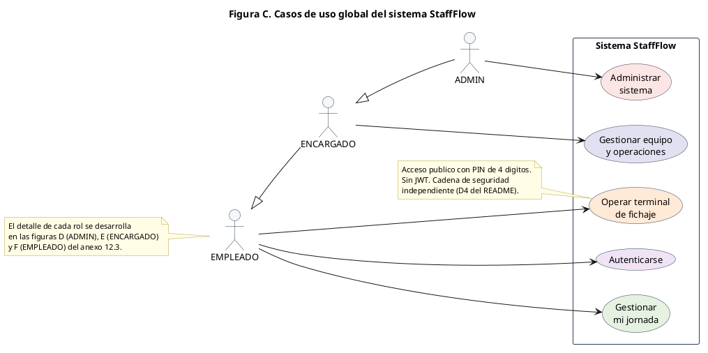
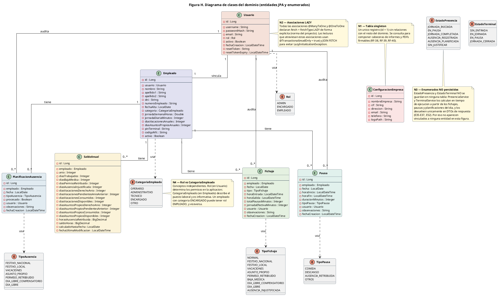
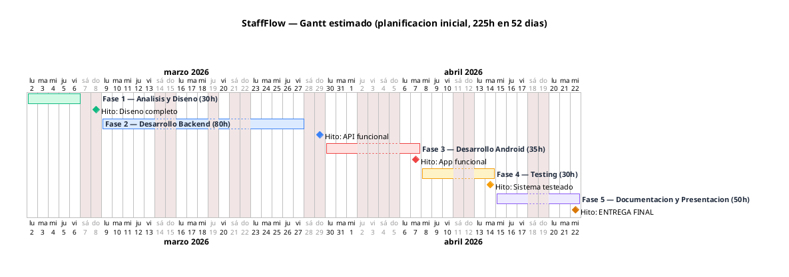
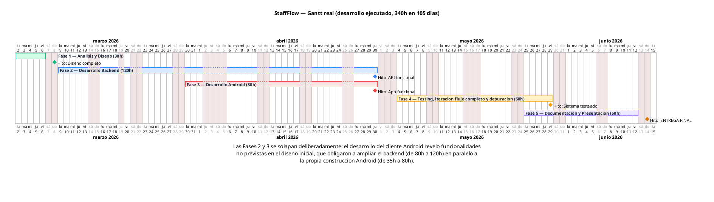

# StaffFlow — Informe técnico

**Proyecto:** StaffFlow v1.0.0 · Trabajo Final de Grado DAM, iLERNA, entregado
el 15 de junio de 2026, calificación 9,4
**Autor y mantenedor:** Santiago
**Última actualización:** 3 de septiembre de 2026 (revisión posterior a la
entrega; 355 commits hasta v1.0.0, ~32.400 líneas de código de producción)

Este documento describe el proyecto completo — propósito, tecnología,
arquitectura, capas, seguridad, dominio, testing, proceso y despliegue — de
forma autocontenida. Documentos complementarios:

- [`decisiones.md`](decisiones.md) — las decisiones de diseño y su porqué.
- [`manual-usuario.md`](manual-usuario.md) — uso de la aplicación por rol.
- [`roadmap.md`](roadmap.md) — las trece líneas de evolución de v2.
- [`despliegue.md`](despliegue.md) — instalación y despliegue paso a paso.
- [`../README.md`](../README.md) — presentación del repositorio.

**Leyenda de códigos.** A lo largo del informe se usan los identificadores del
proyecto: **E01–E68** endpoints REST; **P01–P30** pantallas Android;
**RF-nn** requisitos funcionales; **RNF-Xnn** requisitos no funcionales
(S seguridad, L legal, I integridad); **M-nnn** mejoras y gaps registrados
para v2 (por ejemplo M-042); **ADR** decisiones de arquitectura referenciadas
desde `decisiones.md`.

---

## 1. Resumen ejecutivo

StaffFlow es un sistema de **registro horario y gestión de ausencias para pymes
españolas**, construido para cumplir el **RD-ley 8/2019** (registro diario
obligatorio de jornada y conservación de los datos durante 4 años). Consta de
dos módulos: un **backend REST** (Java 21 / Spring Boot 3.5) y una **aplicación
Android** (Kotlin) que funciona a la vez como terminal de fichaje compartido
(tablet en modo kiosco, autenticación por PIN) y como app de gestión para tres
roles (EMPLEADO, ENCARGADO, ADMIN).

El diferenciador frente a las suites HR comerciales (Factorial, Sesame, Bizneo,
Sage): despliegue **self-hosted sin licencia**, foco exclusivo en control
horario (no suite de talento completa) y fichaje en **hardware estándar** — una
tablet cualquiera con PIN, con NFC previsto para v2.

Cifras del proyecto: **68 endpoints** REST versionados, **30 pantallas**
Android, **7 entidades** de dominio, **341 tests** de backend en verde
(27 clases de test, 0 fallos), **57 anotaciones** `@PreAuthorize`, 1 proceso
programado (cierre nocturno). Desarrollado por un único autor entre marzo y
junio de 2026.

## 2. El problema de negocio

El RD-ley 8/2019 obliga a **todas** las empresas españolas a registrar la
jornada diaria de cada trabajador, conservar esos registros 4 años y tenerlos
a disposición de la Inspección de Trabajo. Las pymes pequeñas (bares, talleres,
tiendas) suelen resolverlo con papel u hojas de cálculo: frágil, no auditable
y difícil de defender ante una inspección. Las alternativas comerciales son
cloud-only, de pago por empleado/mes, y asumen que cada empleado usa su móvil.

StaffFlow cubre ese hueco: un sistema que la propia pyme aloja, con una tablet
compartida en la pared como punto de fichaje, informes PDF firmables listos
para inspección, y gestión de ausencias y saldos anuales integrada.

## 3. Visión general del sistema

```
   Tablet compartida (kiosco)          App Android (misma APK)
   ┌───────────────────────┐   ┌──────────────────────────────────┐
   │  Terminal PIN (P01)   │   │ EMPLEADO   ENCARGADO   ADMIN     │
   │  entrada/salida/pausa │   │ (/me)      (operativa) (gestión) │
   └───────────┬───────────┘   └───────────────┬──────────────────┘
               │ PIN, sin JWT                  │ JWT (12 h)
               ▼                               ▼
   ┌──────────────────────────────────────────────────────────────┐
   │      Backend Spring Boot — 68 endpoints /api/v1/             │
   │  controller → service → domain.repository → domain.entity    │
   │  + cierre nocturno programado (23:55)  + informes PDF/HTML   │
   └───────────────────────────┬──────────────────────────────────┘
                               ▼
                    MySQL 8 (prod) / H2 en memoria (dev)
```



*Casos de uso globales: los tres roles autenticados y el terminal compartido
frente al sistema. Los diagramas por rol están en `img/casos-uso-*.png`.*

**Actores:**

- **EMPLEADO** — consume exclusivamente sus propios datos vía endpoints `/me`
  (perfil, fichajes, pausas, ausencias, saldo, parte diario propio). Cualquier
  intento de acceder a datos ajenos recibe HTTP 403. Ficha por PIN en el terminal.
- **ENCARGADO** — todo lo del EMPLEADO más la operativa del equipo: parte
  diario, corrección de fichajes/pausas, planificación de ausencias, saldos,
  informes y desbloqueo del terminal. Restricción temporal: fichajes y pausas
  solo del día en curso (antes del cierre nocturno); ausencias de hoy en
  adelante; el pasado es exclusivo del ADMIN (ver §8.6).
- **ADMIN** — configuración de empresa, gestión de usuarios y empleados
  (el alta de perfiles laborales, E13, es exclusiva de este rol), recálculo
  forzado de saldos. **No tiene ficha de empleado y no ficha**: sus
  credenciales son de gestión, no de presencia
  ([decisión 4](decisiones.md#4-el-admin-no-ficha-identidad-de-acceso--identidad-laboral)).
  Es el único rol que puede corregir registros pasados (auditado).
- **Terminal (sin rol)** — 5 endpoints públicos autenticados por PIN de
  4 dígitos, en una cadena de seguridad aislada (ver §8.2).
- **`terminal_service`** — usuario sistema, autor técnico de los registros
  generados por el terminal y por el cierre nocturno (ver §8.7). Nunca se usa
  para login.

Los roles son un **reparto matricial por módulo, no una jerarquía**: el ADMIN
no "incluye" al ENCARGADO (p. ej., no puede usar `/me` porque no tiene ficha).

## 4. Tecnología utilizada

### Backend (`staffflow-backend`, Maven)

| Componente | Versión | Uso |
|---|---|---|
| Java (Temurin) | 21 LTS | Lenguaje |
| Spring Boot | 3.5.11 | Framework (web, data-jpa, security, validation, mail) |
| Hibernate/JPA | vía starter | ORM |
| MySQL / H2 | 8.0 / en memoria | Persistencia prod / dev |
| jjwt | 0.12.6 | Emisión y validación JWT (HMAC-SHA) |
| SpringDoc OpenAPI | 2.8.16 | Swagger UI (`/swagger-ui.html`) |
| iText 7 | 7.2.6 | Generación de PDF firmables |
| Lombok | — | Reducción de boilerplate |
| JUnit 5 + Mockito + ArchUnit | ArchUnit 1.4.0 | Testing (§10) |

### Cliente Android (`staffflow-android`, Gradle con version catalog)

| Componente | Versión | Uso |
|---|---|---|
| Kotlin | 2.1.0 | Lenguaje |
| AGP / SDK | 8.13.0 / target 36, min 24 (Android 7.0) | Build |
| Retrofit + Gson + OkHttp | 2.9.0 / 4.12.0 | Cliente REST |
| Navigation Component | 2.8.0 | Navegación Single-Activity |
| Coroutines + StateFlow | 1.8.1 | Asincronía y estado |
| DataStore Preferences | 1.1.1 | Sesión y configuración local |
| ViewBinding + XML + Material 3 | — | UI (sin Compose) |

### Herramientas e integración continua

Git/GitHub, IntelliJ IDEA, Android Studio, MySQL Workbench, Spring Initializr.

La integración continua se añadió tras la entrega, en
`.github/workflows/ci.yml`, con dos jobs sobre `push` y `pull_request` a
`main`: `backend` (Temurin 21, `./mvnw -B test`, caché de Maven) y `android`
(Temurin 21, `./gradlew assembleDebug`). Durante el desarrollo del TFG no
hubo CI; los tests se ejecutaban localmente antes de cada merge a `main`.
No hay linters configurados (§12).

## 5. Arquitectura del backend

### 5.1 Estilo: capas clásicas, verificadas por revisión

Arquitectura en capas explícita y consistente. Se descartó la arquitectura
hexagonal: a esta escala los puertos y adaptadores añadirían indirección sin
beneficio.

```
controller  → recibe HTTP, valida DTOs (@Valid), delega. Nunca toca entidades.
service     → toda la lógica de negocio. Único dueño de las transacciones.
domain      → entity (JPA), enums, repository (Spring Data).
dto         → request/ (19) y response/ (18): el contrato público de la API.
exception   → modelo de excepciones de dominio + GlobalExceptionHandler.
security    → JwtTokenProvider, JwtAuthFilter, UserDetailsServiceImpl.
config      → SecurityConfig (2 filter chains), OpenApiConfig, ClockConfig.
```

Tres invariantes **verificados** (no solo convención):

1. Ningún controller importa `domain.repository` (cero ocurrencias).
2. Ningún controller importa `domain.entity` — las entidades nunca cruzan la
   capa de servicio; la API solo habla DTOs.
3. Un test **ArchUnit** (`ServiceLayerArchitectureTest`) rompe el build si un
   servicio lanza `IllegalStateException` (reservada para fallos internos
   genuinos 5xx). Las dos invariantes anteriores no tienen regla automática:
   se verifican por revisión.



*Diagrama de clases del backend: controllers, services, entidades y
repositorios, con el sentido único de las dependencias entre capas.*

### 5.2 Convenciones transversales

- API versionada bajo `/api/v1/`; rutas `/me` declaradas antes de `/{id}`.
- PATCH para cambios parciales o de estado, POST para acciones. Recalcular
  saldos (E40) es POST porque no modifica campos parciales: regenera el
  registro completo desde cero (convención cerrada en Fase 1 y documentada en
  `SaldoController`).
- Unicidad validada **preventivamente** (`existsBy...`) antes de persistir,
  con la constraint UNIQUE de la base de datos como red. Así el 409 llega con
  un mensaje claro que nombra el campo en conflicto.
- Respuestas de acción con `MensajeResponse` (texto del servidor) en vez de
  204 vacío, para que el cliente Android muestre la confirmación en un
  snackbar sin hardcodear mensajes.
- `Clock` inyectado como bean (`ClockConfig`) — "hoy" es fijable en tests.
- Fetch JPA explícito: las 8 asociaciones `@ManyToOne`/`@OneToOne` declaran
  `LAZY`; lecturas con `@Transactional(readOnly = true)` y `JOIN FETCH`.

### 5.3 Manejo de errores

`GlobalExceptionHandler` (382 líneas) registra 12 `@ExceptionHandler` sobre un
modelo de excepciones de dominio: `NotFoundException` → 404,
`ConflictException` → 409, `RangoConflictException` → 409 con lista de fechas
conflictivas, `PinBloqueadoException` → 423, `IllegalArgumentException` → 400,
más un catch-all → 500. En todo el repositorio no existe ni un
`printStackTrace()` ni un `System.out.println`. Los errores de autenticación
son genéricos (no revelan si falló usuario o contraseña).

## 6. Modelo de dominio

### 6.1 Las 7 entidades

| Entidad | Propósito | Claves/constraints relevantes |
|---|---|---|
| `ConfiguracionEmpresa` | Singleton (id=1): razón social, CIF, logo para PDFs | UNIQUE(cif). Sin relaciones con el resto |
| `Usuario` | Identidad de acceso: username, hash BCrypt, email, rol, activo | UNIQUE(username), UNIQUE(email) |
| `Empleado` | Identidad laboral: DNI, nº empleado, jornada, PIN, NFC, fecha de alta | 1:1 con Usuario — UNIQUE(usuario_id); UNIQUE(dni, numero_empleado, pin_terminal, codigo_nfc) |
| `Fichaje` | La jornada de un día: entrada, salida, tipo, minutos efectivos | **UNIQUE(empleado, fecha)** — un fichaje por día; usuario_id (autor) NOT NULL |
| `Pausa` | Pausa dentro de una jornada, con tipo y duración | usuario_id NOT NULL |
| `PlanificacionAusencia` | Ausencia futura planificada, un registro por día | UNIQUE(empleado, fecha); empleado NULL = festivo global; flag `procesado` |
| `SaldoAnual` | Contadores anuales: vacaciones, asuntos propios, horas | UNIQUE(empleado, año); creado on-demand solo para el año en curso |


*Modelo entidad-relación de las 7 tablas: la relación 1:1 usuario–empleado y
las claves únicas compuestas (empleado + fecha, empleado + año).*

Separaciones estructurales del modelo (el patrón dominante del proyecto):
usuario ≠ empleado (acceso vs. presencia) · planificado ≠ materializado
(`PlanificacionAusencia.procesado` distingue intención de hecho) · autor
técnico ≠ decisor humano (usuario_id vs. observaciones) · cálculo ≠ consulta
(los inactivos quedan fuera del cálculo pero sus datos siguen consultables,
[decisión 12](decisiones.md#12-deshabilitación-reversible-excedencias-sin-corromper-saldos)).

Los saldos anuales se crean on-demand únicamente para el año en curso: así
no se persisten registros vacíos de años sin actividad y la consulta no
devuelve 404 antes del primer cierre del año.

### 6.2 Enums de dominio

`Rol` (3) · `CategoriaEmpleado` (5 — **informativa, nunca autorización**,
[decisión 15](decisiones.md#15-categoría--rol-qué-hace-vs-qué-puede-hacer)) ·
`TipoFichaje` (10: NORMAL, VACACIONES, BAJA_MEDICA, FESTIVO_NACIONAL/LOCAL,
ASUNTO_PROPIO, PERMISO_RETRIBUIDO, DIA_LIBRE[_COMPENSATORIO],
AUSENCIA_INJUSTIFICADA) · `TipoPausa` (4: COMIDA, DESCANSO,
AUSENCIA_RETRIBUIDA — no descuenta jornada —, OTROS) · `TipoAusencia` (7) ·
`EstadoPresencia` (6, no persistido) · `EstadoTerminal` (4, no persistido).

### 6.3 El parte diario de 6 estados

`EstadoPresencia` es una **proyección derivada en tiempo real** — nunca se
persiste, por lo que no puede desincronizarse. `PresenciaService` clasifica a
cada empleado evaluando en orden estricto de prioridad (gana la primera):

1. `EN_PAUSA` — existe una pausa abierta hoy.
2. `JORNADA_COMPLETADA` — fichaje con hora de salida.
3. `JORNADA_INICIADA` — entrada sin salida, sin pausa activa.
4. `AUSENCIA_REGISTRADA` — fichaje sin horas (ausencia ya materializada).
5. `AUSENCIA_PLANIFICADA` — planificación pendiente (`procesado=false`).
6. `SIN_JUSTIFICAR` — nada: requiere atención del encargado (pantalla propia).

Tres tablas colapsan en una clasificación ordenada; el cierre nocturno que
marca `procesado=true` mueve al empleado del estado 5 al 4 sin que la UI
cambie nada. El parte diario solo incluye empleados operativos en la fecha
(`activo = true AND fechaAlta <= fecha`).

### 6.4 Reglas de cálculo

- Jornada diaria = `round(jornadaSemanalHoras / 5 × 60)` minutos (semana fija
  L-V, corte de alcance de v1; turnos en roadmap 2.2 —
  [decisión 10](decisiones.md#10-semana-fija-l-v-corte-de-alcance-consciente)).
- Jornada efectiva = `ceil(minutosBrutos − pausasDescontables)`; duración de
  pausa = `floor(...)`. **Ambos redondeos favorecen al empleado**
  ([decisión 3](decisiones.md#3-redondeo-asimétrico-siempre-a-favor-del-empleado)).
- Vacaciones prorrateadas por fecha de alta con `ceil` (el empleado no pierde
  fracción de día); asuntos propios con `round`. Por coherencia con el
  prorrateo, las altas retroactivas se rechazan (400) — las diferidas se
  permiten ([decisiones 11 y 18](decisiones.md#11-alta-diferida-existir-en-el-sistema--empezar-a-trabajar)).

### 6.5 El cierre nocturno (`ProcesoCierreDiario`)

Único proceso programado del sistema: `ProcesoCierreDiario.ejecutar()`, con
`@Scheduled(cron = "0 55 23 * * *")` y `@Transactional` — las tres tareas
corren en una sola transacción; si una falla, ninguna llega a la BD. Trabaja
solo sobre los empleados operativos ese día
(`findByActivoTrueAndFechaAltaLessThanEqual(hoy)`): los inactivos (excedencias)
no acumulan ausencias, y los de alta diferida no existen para el proceso hasta
su `fechaAlta`.

1. **Tarea A — cerrar el día**: cada empleado sin fichaje recibe
   `AUSENCIA_INJUSTIFICADA` (lunes a viernes) o `DIA_LIBRE` (sábado y domingo),
   firmado por `terminal_service`. Ningún día queda sin fila en la BD.
2. **Tarea B — materializar planificaciones**: las `PlanificacionAusencia` con
   `procesado=false` y fecha ≤ mañana se convierten en fichajes del tipo
   equivalente y se marcan `procesado=true`. El "≤ mañana" procesa los
   festivos globales la noche anterior, para que al día siguiente la Tarea A
   no genere injustificadas; si mañana es fin de semana, siembra además
   `DIA_LIBRE` para toda la plantilla.
3. **Tarea C — recalcular saldos**: `SaldoService.recalcularParaProceso()` por
   empleado, siempre en último lugar, para que el saldo incluya la penalización
   recién creada en A y las ausencias materializadas en B.

Es idempotente: comprueba la existencia del fichaje antes de crear y
`procesado=true` evita reprocesar, así que ejecutarlo dos veces el mismo día
no duplica nada (lo que permite el disparo manual de demo, §7). Correr a las
23:55 y no a las 00:00 crea el registro dentro del día que documenta: a
medianoche todo empleado tiene su fila. Matiz: entre 23:55 y 00:00 el
ENCARGADO aún puede editar "hoy"; es benigno, porque la corrección es legítima
y el siguiente cierre recalcula. Al día siguiente ese registro ya es pasado y
solo el ADMIN puede tocarlo (§8.6). El razonamiento completo está en la
[decisión 9](decisiones.md#9-cierre-nocturno-a-las-2355-ningún-día-termina-indefinido).

Lo que el proceso no hace: recuperar cierres no ejecutados. Si el backend está
apagado a las 23:55, ningún fichaje se pierde (cada marcaje del terminal se
persiste en el momento y la Tarea A nunca modifica filas existentes), pero
quien no fichó ese día se queda sin su `AUSENCIA_INJUSTIFICADA`, porque la
ejecución siguiente solo procesa "hoy"; el ADMIN puede crearla después con
E22. Las planificaciones pendientes sí se recuperan (la Tarea B no acota la
fecha por abajo) y los saldos se recalculan desde cero. El riesgo real de una
caída está en horario de trabajo: la app no tiene modo offline ni cola de
reintentos, así que un PIN marcado sin servidor no se registra
([roadmap 2.13](roadmap.md#213-cierre-con-recuperación-y-terminal-offline)).

## 7. API REST

68 endpoints productivos (E01–E68; 67 bajo `/api/v1/` más `GET /api/health`)
en 13 controllers / 13 grupos funcionales, documentados en Swagger UI (acceso
público en ambos perfiles, ver §8.9). Verbos: 38 GET, 16 POST, 9 PATCH, 3 DELETE, 2 PUT (= 68).

| Grupo | Endpoints | Acceso (resumen) |
|---|---:|---|
| auth | 5 | E01 login y E04 recuperación públicos; E02 `/me` y E03 cambio de contraseña con sesión autenticada; E05 reservado para v2 |
| empresa | 2 | Configuración de empresa (GET y PUT), solo ADMIN |
| usuarios | 7 | Gestión de cuentas, solo ADMIN (baja lógica en `DELETE /usuarios/{id}`) |
| empleados | 11 | E13 alta de perfil laboral y E68 **solo ADMIN**; E14–E20 ADMIN y ENCARGADO; E21 `/me` para EMPLEADO y ENCARGADO |
| fichajes | 5 | Operativa ADMIN/ENCARGADO con restricción temporal (§8.6); `/me` para el empleado |
| pausas | 4 | Igual que fichajes |
| ausencias | 9 | Planificación ADMIN/ENCARGADO; E63 rango; borrado solo de no procesadas |
| presencia | 3 | Parte diario y estado en tiempo real; `/me` para el empleado |
| saldos | 4 | Consulta por rol; E40 recálculo forzado solo ADMIN |
| informes HTML | 6 | Grids interactivos para WebView, permisos embebidos por rol |
| PDF | 4 | Informes firmables para inspección |
| terminal | 7 | E48–E52 públicos por PIN; E53/E54 (bloqueo) exigen JWT de ADMIN o ENCARGADO |
| health | 1 | `GET /api/health`, público |
| **Total** | **68** | |

Fuera de esa cifra queda un endpoint de test en un 14.º controller (`POST
/api/v1/test/cierre-diario`, `@Profile("dev")`) que dispara el cierre
nocturno bajo demanda para demos; Spring lo excluye por completo del perfil
de producción.

Patrones de API destacables:

- **Endpoints `/me`**: el EMPLEADO nunca pasa IDs; el backend resuelve la
  identidad desde el JWT. Elimina toda una clase de IDOR por construcción.
- **E63 rango de ausencias**: azúcar de API — el modelo sigue siendo un
  registro por día
  ([decisión 16](decisiones.md#16-ausencias-un-registro-por-día-nunca-rangos-en-la-base)).
  Conflictos → 409 con `fechasConflictivas` para que la app pregunte
  "¿sobrescribir?"; los días ya materializados son inmutables (400).
- **Informes duales**: mismo dato como HTML interactivo (WebView) o PDF
  firmable; los grids HTML embeben URLs `staffflow://` que la app intercepta
  para abrir formularios nativos (§9.3).

## 8. Seguridad

### 8.1 Autenticación de usuarios: JWT

Login (E01) → token JWT firmado HMAC-SHA (jjwt), validez **12 h**,
dimensionada para la jornada partida española (8 h + hasta 4 h de pausa de
comida) sin re-login a mitad de turno
([decisión 2](decisiones.md#2-jwt-de-12-horas-dimensionado-por-la-jornada-partida)).
Token único (sin refresh) como tradeoff asumido de v1; roadmap 2.4 migra a
access corto + refresh. Passwords con **BCrypt**. `JwtAuthFilter` puebla el
SecurityContext por petición; la sesión es stateless.

### 8.2 Doble cadena de filtros: el aislamiento del terminal

`SecurityConfig` define **dos `SecurityFilterChain` independientes**:

- **Order(1)** — scoped por `securityMatcher` a los 5 endpoints públicos del
  terminal (E48–E52). Sin JWT: la autenticación es el PIN dentro del cuerpo.
  Sin este aislamiento, el filtro JWT rechazaría con 401 las peticiones del
  terminal, que llegan sin Bearer.
- **Order(2)** — todo lo demás: JWT stateless, `@EnableMethodSecurity`, y
  cierre restrictivo `.anyRequest().authenticated()`.

La gestión del bloqueo del terminal (E53 consultar / E54 desbloquear) queda
deliberadamente fuera de la cadena pública: exige JWT de ADMIN o ENCARGADO.
El terminal compartido nunca expone datos personales más allá del saludo y el
resumen del día fichado.

### 8.3 Autorización: 57 `@PreAuthorize` + autorización por campo

Cada endpoint protegido declara su regla (`hasRole`, `hasAnyRole`). En el
controller de empleados, la operativa (E14–E20) admite ADMIN y ENCARGADO, y
dos endpoints son exclusivos de ADMIN: E13 (alta de perfil laboral, que es
una operación de alta reservada al administrador) y E68. Además hay
**autorización a nivel de campo**: E15 devuelve `pinTerminal`, `email`,
`username` y `rol` solo si el llamante es ADMIN; el ENCARGADO recibe null en
esos campos ("Opción A",
[decisión 8](decisiones.md#8-visibilidad-del-pin-por-campo-no-por-endpoint-opción-a)).
Dos tests estructurales auditan por **reflexión** que ningún endpoint quede
sin anotación y que cada uno lleve la expresión esperada
(`EmpleadoControllerSecurityTest` comprueba, entre otros, que E13 use
`hasRole('ADMIN')`).

### 8.4 El PIN del terminal

Resumen de las
[decisiones 7](decisiones.md#7-pins-aleatorios-únicos-y-visibles-una-sola-vez)
y [20](decisiones.md#20-bloqueo-del-terminal-por-dispositivo-no-por-empleado):

- Generación: `SecureRandom` sobre 0000–9999, bucle contra
  `existsByPinTerminal` + UNIQUE en BD. La unicidad global es funcional: en el
  terminal el PIN es identificador y credencial (no se teclea usuario).
- Entrega: al generar/regenerar (E13/E65) se muestra **una sola vez** para
  entregar en mano; no puede volver a consultarse por esa vía. Regeneran ADMIN
  y ENCARGADO; consulta solo ADMIN.
- Fuerza bruta: 5 intentos fallidos por `dispositivoId` → HTTP **423 Locked**
  (el recurso bloqueado es el dispositivo, no una cuenta). Desbloqueo por E54
  o reinicio.

### 8.5 Anti-enumeración (RNF-S04)

- Recuperación de contraseña (E04): misma respuesta 200 exista o no el email;
  la app muestra siempre la misma confirmación; el copy está en condicional
  ("Si el email está registrado recibirás un correo…"). E04 envía una
  contraseña temporal de 8 caracteres (SecureRandom, alfabeto sin ambiguos,
  hash BCrypt sobrescrito, SMTP asíncrono). E05 (reset por token) es
  andamiaje de v2 ya construido. Detalle completo en la
  [decisión 13](decisiones.md#13-recuperación-de-contraseña-sin-filtrar-información).
- Login: un usuario desactivado recibe la misma `UsernameNotFoundException`
  y el mismo mensaje que un usuario inexistente, para evitar la enumeración
  de cuentas activas e inactivas (`UserDetailsServiceImpl`); el mensaje de
  error de autenticación tampoco revela si falló el username o la
  contraseña.

### 8.6 Permisos temporales (legalidad laboral)

El ENCARGADO opera el presente y planifica el futuro: fichajes y pausas solo
del **día en curso** (antes del cierre nocturno; el backend rechaza además
fichajes en fechas futuras para cualquier rol) y ausencias de **hoy en
adelante**. El ADMIN es el único que toca el pasado, siempre con
`observaciones` obligatorias y autor registrado. La regla se aplica en la
capa de servicio (`FichajeService`, `AusenciaService`) comparando la fecha de
la base de datos, no la del request, y se refleja en los grids HTML (celdas
prohibidas no editables): defensa en profundidad. Combinado con el cierre
nocturno, "solo ADMIN quita una ausencia injustificada" emerge de componer
dos reglas, sin código específico. Justificación legal en la
[decisión 6](decisiones.md#6-permisos-temporales-por-legalidad-laboral).

### 8.7 Trazabilidad

`usuario_id NOT NULL` en fichajes y pausas (RNF-L01). El terminal y el cierre
nocturno — que no tienen sesión — firman con el usuario sistema
`terminal_service`, buscado por username y no por id autoincremental, que
difiere entre dev y prod
([decisión 19](decisiones.md#19-terminal_service-autoría-técnica-sin-sesión)).

Las correcciones manuales se hacen **sobre el propio registro** (no hay
versionado): lo que queda es el valor corregido, el autor y las
`observaciones` obligatorias que explican el porqué. Los informes marcan con
asterisco el fichaje intervenido manualmente, pero no pueden saber qué valor
tenía antes (`InformeService`).

El historial de 4 años se protege con bajas lógicas: usuarios y empleados se
desactivan, nunca se borran (`DELETE /usuarios/{id}` es una desactivación
reversible; los empleados se dan de baja por `PATCH /empleados/{id}/baja`).
De los 3 DELETE de la API, el único borrado real es `DELETE /ausencias/{id}`,
limitado a planificaciones aún no materializadas (`procesado=false`; 409 si ya
generaron fichaje); `DELETE /terminal/bloqueo` solo reinicia un contador en
memoria. Un fichaje o una pausa, una vez creados, no se eliminan por ninguna
vía.

### 8.8 Gestión de secretos y configuración por entorno

El perfil `mysql` (producción) toma toda la configuración sensible de
variables de entorno, sin valores por defecto para las credenciales:

| Variable | Obligatoria | Uso |
|---|---|---|
| `DB_USERNAME`, `DB_PASSWORD` | Sí | Credenciales de MySQL. Si faltan, la conexión falla al arrancar (`Access denied`) |
| `DB_URL` | No | JDBC URL; por defecto `jdbc:mysql://localhost:3306/staffflow?...` |
| `JWT_SECRET` | Sí | Clave HMAC del JWT. Sin ella el arranque falla con `Could not resolve placeholder 'JWT_SECRET'` |
| `MAIL_USERNAME`, `MAIL_PASSWORD` | Sí (pueden ir vacías) | SMTP. `staffflow.mail.from` se resuelve desde `MAIL_USERNAME` sin valor por defecto: si la variable no existe, el arranque falla (verificado: `Could not resolve placeholder 'MAIL_USERNAME'`). Con valor vacío el servidor arranca y solo falla el envío de correo de E04 |

Las variables `SPRING_DATASOURCE_*` siguen funcionando por el binding relajado
de Spring Boot y tienen prioridad sobre el archivo, pero las documentadas son
las `DB_*`. El perfil `dev` mantiene un secreto JWT de desarrollo claramente
marcado como no apto para producción, rotado tras un incidente real (secreto
filtrado al historial git), documentado y remediado en vez de ocultado
(commit `701c9ae`).

Esta configuración es el resultado de dos correcciones de la revisión
posterior a la entrega, descritas en §8.9: la versión entregada traía
`username: root` y password vacía fijos en el perfil `mysql`, y la
declaración de `JWT_SECRET` no fallaba al arrancar aunque lo pretendiera.

### 8.9 Debilidades de seguridad conocidas

Para que el informe sea completo, se recogen tanto las debilidades corregidas
tras la entrega como las que siguen abiertas.

**Corregidas en la revisión posterior a la entrega (septiembre de 2026):**

1. **`JWT_SECRET` no fallaba al arrancar.** La versión entregada declaraba
   `${JWT_SECRET:?La variable JWT_SECRET es obligatoria para el perfil mysql}`
   copiando la sintaxis de bash. Spring no la soporta: todo lo que sigue a
   `:` es el valor por defecto, así que, sin la variable definida, el backend
   arrancaba con normalidad usando el propio texto del mensaje como clave de
   firma. Un comentario en el archivo afirmaba que el arranque fallaba, y ese
   comentario fue lo que se leyó al documentarlo por primera vez. Ahora es
   `${JWT_SECRET}` sin valor por defecto, y el arranque sin la variable
   termina con `Could not resolve placeholder 'JWT_SECRET'` (comprobado
   arrancando el backend). Lección: el comportamiento fail-fast se verifica
   con un arranque real, no leyendo la configuración.
2. **Credenciales MySQL por defecto.** `username: root` y password vacía
   fijos en `application-mysql.yml`, no sobreescribibles por entorno. Ahora
   `DB_USERNAME` y `DB_PASSWORD` son obligatorias y `DB_URL` opcional (§8.8).
3. **E13 abierto a ENCARGADO.** El alta de perfiles laborales admitía
   `hasAnyRole('ADMIN', 'ENCARGADO')` aunque el diseño y el flujo de la app
   (P29 → E08 → E13) lo reservan al ADMIN. Ahora es `hasRole('ADMIN')` en el
   controller, en el test de seguridad estructural y en la spec
   `openspec/specs/security-authorization`.

**Abiertas** (se publican como issues en GitHub del repositorio):

1. **PINs almacenados en claro** (`CHAR(4)` + `findByPinTerminal` directo).
   Consecuencia: una lectura de la BD es un volcado de credenciales del
   terminal. Mitigación prevista: HMAC determinista (único y buscable).
2. **Lockout en memoria con clave elegida por el cliente** (`dispositivoId`):
   rotar el ID resetea el contador; un reinicio borra los bloqueos. v2 lo
   persiste (roadmap 2.5).
3. **Android**: logging de cuerpos HTTP (`HttpLoggingInterceptor.Level.BODY`)
   sin guard de `BuildConfig.DEBUG` (JWTs y PINs a logcat en release), tráfico
   HTTP en claro (`usesCleartextTraffic="true"`), JWT en DataStore sin cifrar.
4. **Sin migraciones de esquema** (Flyway/Liquibase): la evolución del DDL es
   manual (§11.1).
5. **Android sin tests** más allá de `ApiErrorMapperTest` (§10.3).
6. **Dependencia frágil de `terminal_service`** (gap M-042): el terminal y el
   cierre nocturno localizan al usuario sistema por username, y nada en el
   código protege esa fila — se puede desactivar por E12 como cualquier otro
   usuario (la búsqueda ignora `activo`, así que hoy no rompe, pero deja un
   autor inactivo firmando registros) y, si falta o se renombra en la BD, el
   cierre nocturno falla con `NotFoundException` (rollback completo, ningún
   fichaje automático ese día) y el terminal deja de poder firmar.
7. **Sin bootstrap del perfil `mysql`**: nada crea `terminal_service` ni un
   ADMIN inicial sobre una base de datos vacía; el operador debe insertarlos
   con el SQL manual documentado en [`despliegue.md`](despliegue.md)
   (roadmap 2.11).
8. **Swagger UI público en ambos perfiles**: `/swagger-ui/**` y
   `/v3/api-docs/**` están permitidos sin autenticación en `SecurityConfig` y
   springdoc no se desactiva en `mysql`, así que el catálogo de la API queda
   expuesto en producción. Mitigación sencilla: restringirlo al perfil `dev`
   o protegerlo con JWT.

## 9. Cliente Android

### 9.1 Arquitectura

**MVVM con Single Activity + Navigation Component**: una `MainActivity`, 30
Fragments (P01–P30 sin huecos) declarados en `nav_graph.xml`, un ViewModel por
pantalla (29), StateFlow + coroutines, ViewBinding sobre layouts XML
(sin Compose — decisión de alcance). Capa de datos: 11 interfaces Retrofit +
11 repositorios. Sin inyección de dependencias (singletons manuales
`NetworkModule`, `SessionManager`) — la causa principal de que la capa
Android carezca de tests (§10.3).


*Grafo de navegación (`nav_graph.xml`): las 30 pantallas y sus transiciones,
con el terminal P01 como destino inicial.*

Organización por bloques funcionales: `ui/{login, fichaje, empleado,
encargado, admin, shared}` — 6 bloques que mapean 1:1 con los grupos del menú
lateral, cuya visibilidad se filtra por rol (`menu.setGroupVisible`), con el
backend reforzando cada regla vía 403 (la UI filtra, el servidor decide).

### 9.2 UX de kiosco

Resumen de la
[decisión 21](decisiones.md#21-la-tablet-es-el-usuario-decisiones-de-ux-de-kiosco):

- El terminal (P01) es la pantalla de inicio **aunque exista sesión JWT
  restaurada**: una tablet compartida nunca arranca en los datos del último
  usuario logueado.
- Teclado PIN sin botón confirmar: el cuarto dígito dispara la verificación.
- Modo pantalla completa (oculta status y navigation bar).
- Tras cada acción, retorno automático al teclado para la siguiente persona.
- E52 verifica el PIN una sola vez y pasa el estado por Bundle a la pantalla
  de confirmación (no re-consulta).
- `SessionManager.clear()` preserva la URL del backend: configuración del
  dispositivo, no de la sesión.
- Auto-detección del backend al primer arranque: sondeo de `10.0.2.2` y
  `127.0.0.1` con `GET /api/health`, persistencia del ganador en DataStore.


*P01, el terminal de fichaje en la tablet: teclado numérico sin botón de
confirmación y sin datos personales en pantalla.*

### 9.3 Patrón híbrido WebView + deep links

Los informes tabulares (resumen semanal, grid de ausencias empleado × día) se
renderizan **en el servidor** como HTML interactivo dentro de un WebView. Las
celdas emiten URLs custom `staffflow://...` que el `WebViewClient` intercepta
para navegar a formularios **nativos** de edición (fichaje P20, ausencia P24).
Los permisos de edición por rol van embebidos en el HTML generado y
reforzados en el servicio. El grid de ausencias añade un selector JS
multi-celda para acciones en bloque. Ventaja: tablas complejas sin duplicar
lógica de presentación en el cliente; edición con UX nativa.


*Grid de ausencias empleado × día renderizado por el backend dentro del
WebView; cada celda editable enlaza a un formulario nativo vía `staffflow://`.*

### 9.4 Reutilización de pantallas

Las 30 pantallas se construyeron sobre un puñado de esqueletos reutilizados
(login como base de recovery/cambio/reset; un esqueleto filtro+WebView+export
para 6 pantallas de informe; los informes por empleado reutilizan layouts
cambiando solo el endpoint). Efecto registrado en la planificación: de
~60-70 h estimadas a ~30 h reales para el bloque de UI.

### 9.5 Resiliencia de flujo

- 409 al crear usuario = colisión de username: la app regenera el siguiente
  username libre y reintenta **sin perder el formulario**.
- Un 401 de `/auth/login` no dispara el flujo de sesión caducada: el
  interceptor de `NetworkModule` solo emite `SessionExpired` en rutas
  autenticadas, porque en el login el 401 significa credenciales
  incorrectas, no expiración.
- La cabecera informativa del formulario de usuario falla en silencio ante un
  404 esperado (usuarios sin empleado vinculado): la cabecera es informativa
  y no debe romper el flujo (`FormUsuarioViewModel`).

## 10. Testing

### 10.1 Estrategia backend: 341 tests sin contexto de Spring

Cero `@SpringBootTest` / `@WebMvcTest`. 341 tests en 27 clases, 0 fallos;
16 de las clases organizan sus casos con `@Nested`. Composición:

| Tipo | Cantidad aprox. | Qué verifica |
|---|---|---|
| Unit Mockito por servicio | 291 | Lógica de negocio pura (suites mayores: Ausencia 35, Fichaje 33, Saldo 25, Pausa 21, Terminal 21, Auth 19) |
| Seguridad estructural por reflexión | 30 | Que cada endpoint tenga su `@PreAuthorize` correcto |
| JWT | 10 | Emisión/validación de tokens |
| GlobalExceptionHandler | 9 | Mapeo excepción→HTTP vía MockMvc standalone |
| ArchUnit | 1 | Prohibición de `IllegalStateException` en servicios |

Ratio test/código: **0,54** (9.400 líneas de test sobre 17.300 de producción).
Tradeoff asumido: máxima velocidad y cero dependencia de BD, a costa de no
cubrir el wiring real de Spring (sin tests de integración end-to-end). La
suite se ejecuta en el job `backend` de CI (§4).

### 10.2 Testabilidad por diseño

`Clock` inyectado (fechas fijables), validación preventiva (errores
determinísticos), TDD documentado en los ciclos SDD (RED→GREEN en los
verify-reports de `openspec/`).

### 10.3 El hueco: Android sin tests

15 tests reales (`ApiErrorMapperTest`) y 2 plantillas. Las ~29 ViewModels y
11 repositorios carecen de cobertura; los singletons manuales sin DI hacen
que añadirla exija refactor previo (introducir Hilt/Koin). Es la asimetría
más marcada del proyecto y se mantiene como debilidad abierta (§8.9).

## 11. Persistencia, perfiles y datos de demostración

### 11.1 Perfiles

- **`dev` (evaluador)**: H2 en memoria, `ddl-auto: create-drop`, carga
  automática de `data.sql`, consola H2 y Swagger abiertos. Cero configuración.
- **`mysql` (producción)**: MySQL 8, `ddl-auto: validate` — Hibernate
  **verifica** que el esquema coincida con el DDL canónico
  ([`staffflow-backend/docs/StaffFlowDDL.sql`](../staffflow-backend/docs/StaffFlowDDL.sql),
  291 líneas, 9 UNIQUE con nombre + CHECKs por enum) y no lo modifica. Sin
  herramienta de migraciones (Flyway/Liquibase): la evolución del esquema es
  manual — limitación estructural conocida.

### 11.2 El seed coreografiado (`data.sql`, 2.424 líneas)

No son datos aleatorios: es un **guion de demo**. 10 semanas de datos
(30/03–11/06/2026) para 3 empleados y 5 usuarios; los 10 tipos de fichaje
representados; festivos reales (incluido San Isidro local de Madrid);
vacaciones en bloque de 10 días; bajas médicas; correcciones manuales con sus
observaciones de auditoría; saldos negativos que se recuperan con horas extra;
y el "hoy" simulado (12/06) deliberadamente sin fichajes **para fichar en vivo
durante una demo**. Los comentarios del archivo documentan hasta un bug
corregido (autoría técnica de filas generadas por el scheduler).

## 12. Calidad del código y limitaciones

**Datos de calidad:** 1 solo TODO real en 32k líneas; cero `printStackTrace`
y `System.out`; nomenclatura consistente (dominio en español, framework en
inglés); comentarios que documentan el *porqué* y las alternativas descartadas
(la fuente de `decisiones.md`); 355 commits Conventional Commits.

**Deudas conocidas:** `InformeService.java` (2.399 líneas, 9 dependencias,
HTML por `StringBuilder` en la capa de servicio — candidato a plantillas +
clases por informe) · `PdfService.java` (1.705 líneas, 16 `catch (Exception)`,
2 silenciosos) · `FormUsuarioFragment.kt` (831 líneas) · sin linters · sin
migraciones · Android sin tests ni DI · N+1 acotado y aceptado por escrito
en `SaldoAnualRepository` (volumen actual ≤ 50 empleados, con la query
`JOIN FETCH` alternativa ya preparada para cuando aparezca un N+1 medible)
· sin modo offline en el terminal ni cola de reintentos (un PIN marcado con
el backend caído no se registra) · el cierre nocturno no recupera días en los
que no llegó a ejecutarse (§6.5, roadmap 2.13).

## 13. Proceso de desarrollo

- **Git**: 355 commits (mar–jun 2026), flujo dev→main con merges descriptivos,
  Conventional Commits (`feat:` 54, `fix:` 42, `docs:` 145, `refactor:` 23,
  `test:` 20…).
- **SDD (Spec-Driven Development)**: `openspec/` contiene specs canónicas en
  Given/When/Then (RFC 2119) y 2 ciclos archivados completos
  (proposal→design→tasks→apply→verify→archive), usados como ejercicio de
  hardening del backend al final del proyecto:
  `openspec/changes/archive/2026-05-09-backend-hardening-high-issues/`
  (modelo de excepciones, fetch JPA explícito, `JWT_SECRET` externalizado,
  auditoría de `@PreAuthorize`) y
  `openspec/changes/archive/2026-05-10-regenerar-pin-empleado/` (E65).
- **Uso de IA declarado**: `openspec/AI_USAGE.md` documenta qué decidió el
  autor (dominio, arquitectura, contratos, deuda aceptada) y qué ejecutó la
  IA bajo supervisión (búsquedas, generación de tests TDD, refactors
  mecánicos), con la convención de que ningún commit lleva atribución a IA.
- **Planificación**: Gantt estimado (225 h / 52 días) vs. real (340 h /
  105 días). La desviación se explica porque el desarrollo Android reveló
  funcionalidades no previstas que ampliaron el backend en paralelo; el
  proyecto se entregó en plazo.



*Planificación inicial: 225 h en 52 días.*



*Ejecución real: 340 h en 105 días, con el backend y Android avanzando en
paralelo durante la segunda mitad.*

## 14. Despliegue

Distribución vía **GitHub Release v1.0.0** con tres artefactos autocontenidos
(cada uno con su `INSTALACION.txt` y credenciales demo): imagen Docker
(`docker load` + `docker compose up`, sin necesidad de Java), JAR ejecutable
(Java 21), y APK Android. Alternativas con IDE clonando el repo. Todo converge
en `localhost:8080` con el perfil `dev`.

Los archivos de construcción de la imagen, retirados del repositorio en la
entrega (`ce42860`) y distribuidos solo dentro de la release, se han
restaurado en `docs/instalacion-backend-docker/`:

- `Dockerfile` multistage: `maven:3.9-eclipse-temurin-21` compila el JAR y
  `eclipse-temurin:21-jre-alpine` lo ejecuta; perfil `dev` por defecto, sin
  secretos en la imagen.
- `Dockerfile.dockerignore`: excluye `target/`, `.git` e IDE del contexto.
- `docker-compose.yml`: construye desde el código fuente
  (`docker compose -f docs/instalacion-backend-docker/docker-compose.yml up --build`)
  y pasa `SPRING_PROFILES_ACTIVE`, `DB_URL`, `DB_USERNAME`, `DB_PASSWORD`,
  `JWT_SECRET`, `MAIL_USERNAME` y `MAIL_PASSWORD` desde el entorno del host.

La construcción de la imagen desde estos archivos restaurados está pendiente
de validar en la máquina del mantenedor. El procedimiento completo, perfil a
perfil, está en [`despliegue.md`](despliegue.md).

## 15. Roadmap v2 (resumen)

Trece líneas ordenadas por dependencias, las principales: app móvil de empleado
(fichaje GPS, solicitudes de ausencia con aprobación) · modelo de turnos ·
app de escritorio del encargado · refresh tokens · bloqueo de PIN persistente
· multilocal/multitenant · integración con nóminas · reset de contraseña por
token de un solo uso (andamiaje ya construido) · backups desde ADMIN · SMTP
configurable desde la UI · inicialización automática del perfil `mysql`
(hoy se hace con el SQL de `despliegue.md`) · URL del servidor configurable
desde ajustes en la app · cierre con recuperación de días pendientes y modo
offline del terminal. Fichaje NFC previsto con el dato ya modelado
([decisión 1](decisiones.md#1-nfc-como-método-principal-pin-como-alternativa-económica)).
El roadmap completo, con dependencias y alcance de cada línea, está en
[`roadmap.md`](roadmap.md).

---

## Conclusión

StaffFlow resuelve un dominio con reglas legales concretas mediante una
arquitectura deliberadamente simple y verificada: capas clásicas con guard
rails automáticos (ArchUnit y tests estructurales de seguridad), un modelo de
dominio basado en la **separación sistemática de conceptos** (acceso/presencia,
plan/hecho, cálculo/consulta, presente/pasado) y una seguridad por capas cuyas
debilidades de implementación están identificadas, en parte corregidas tras la
entrega y en parte publicadas como trabajo pendiente. Los 341 tests sin
contexto de Spring, las decisiones documentadas con su porqué en el propio
código y el tratamiento transparente de los incidentes de seguridad (secreto
filtrado y rotado; `JWT_SECRET` que no fallaba al arrancar) son la base sobre
la que se plantea la evolución a v2.
