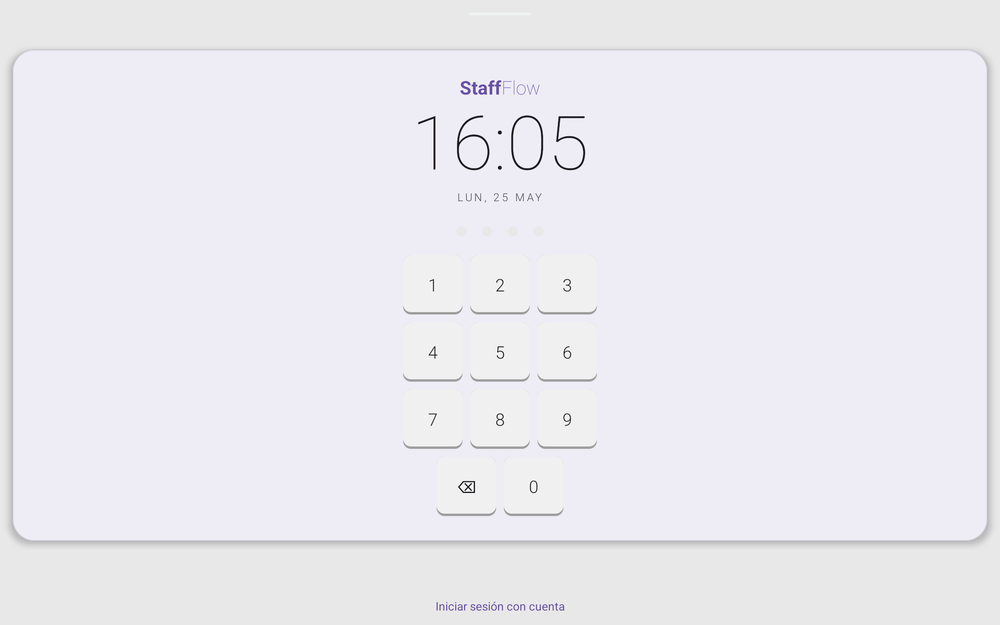
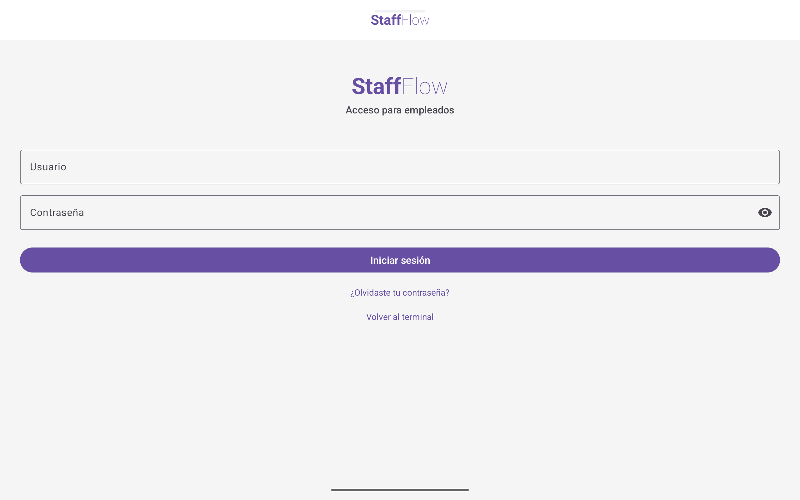
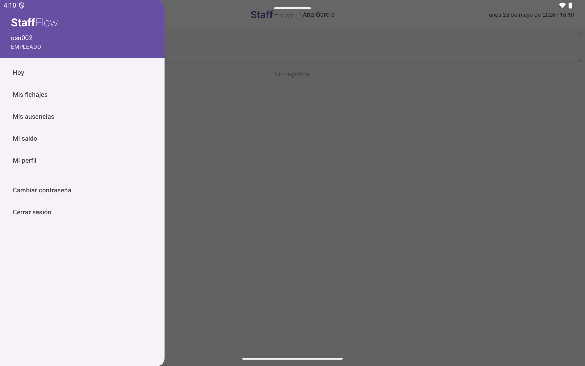
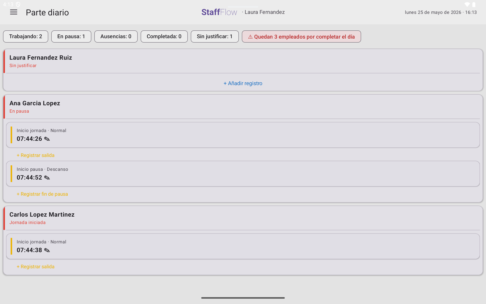
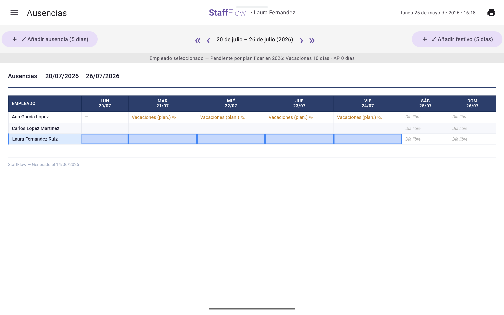
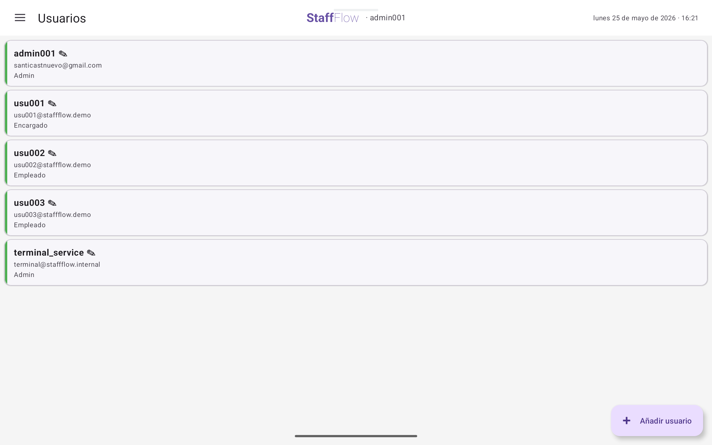

# StaffFlow — Manual de usuario

Guía de uso de StaffFlow v1.0.0, organizada por rol. Cada persona solo
necesita leer su sección. Si vas a poner StaffFlow en marcha por primera
vez, empieza por la sección 0.

---

## 0. Instalación y primer acceso

Esta sección está pensada para una pequeña empresa sin equipo técnico.
StaffFlow tiene dos partes: el **servidor** (un ordenador de la empresa donde
se ejecuta el programa y se guardan los datos) y la **app Android**, que se
instala en la tablet del terminal de fichaje y, si se quiere, en los móviles
de encargados y administración. La instalación del servidor se explica en la
[guía de despliegue](despliegue.md); aquí se cubre lo que se hace desde la
app.

### 0.1 Instalar la app

1. Descarga el archivo `staffflow-android-apk.zip` desde la página de
   versiones del proyecto: <https://github.com/santi-cast/staffflow/releases>.
   Descomprímelo y copia el archivo `.apk` a la tablet o al móvil.
2. Requisito: **Android 7.0 o superior**.
3. Abre el `.apk` desde el dispositivo. Como no procede de Google Play,
   Android te pedirá permitir la instalación de aplicaciones de origen
   desconocido para esa fuente; acéptalo solo para instalar StaffFlow.

### 0.2 Conectar la app con el servidor

La app necesita saber en qué dirección de la red está el servidor. Al abrirse
por primera vez intenta localizarlo sola, pero esa auto-detección solo
comprueba dos direcciones internas (`10.0.2.2` y `127.0.0.1`), que
corresponden al emulador de desarrollo o a un servidor ejecutándose en la
propia tablet. En una instalación real, con el servidor en un ordenador de la
empresa y la app en una tablet, no lo encontrará y la dirección se configura
a mano:

1. Averigua la **dirección IP** del ordenador del servidor en la red local
   (por ejemplo `192.168.1.50`). Quien haya instalado el servidor la conoce.
2. En la tablet abre StaffFlow y teclea cualquier PIN (o pulsa **Iniciar
   sesión con cuenta** e intenta entrar). Al no poder conectar, aparece el
   cuadro **No se pudo conectar al servidor**.
3. Escribe solo la IP en el campo **IP del servidor**: `192.168.1.50`, sin
   `http://` ni puerto (la app usa siempre `http` y el puerto `8080`).
4. Pulsa **Probar conexión**. Cuando veas "Conexión exitosa", pulsa
   **Guardar y continuar**. La app recuerda la dirección de forma permanente,
   también después de cerrar sesión.

Limitaciones de v1.0 que conviene conocer:

- No existe una pantalla de ajustes para cambiar la dirección: el cuadro
  solo aparece cuando la conexión falla. Si el servidor cambia de ordenador o
  de IP, la app volverá a mostrarlo en el siguiente fichaje o inicio de
  sesión y bastará con introducir la nueva.
- Conviene que el ordenador del servidor tenga **IP fija** en el router para
  que la dirección no cambie.
- La conexión es `http` sin cifrar y está pensada para usarse dentro de la
  red local de la empresa.

### 0.3 Primer acceso: la cuenta de administración

En una instalación real (perfil `mysql`) StaffFlow **no crea ninguna cuenta
por sí solo**: la base de datos arranca vacía. Antes del primer uso, quien
instale el servidor debe crear dos registros siguiendo el paso
correspondiente de la [guía de despliegue](despliegue.md):

- La cuenta **ADMIN inicial** (por ejemplo `admin001`), con la que entrarás
  en la app.
- El usuario técnico **`terminal_service`**. No sirve para iniciar sesión: es
  el autor de los fichajes que genera el cierre nocturno. **Si no existe, el
  cierre nocturno de las 23:55 falla** y no se registran las ausencias ni se
  procesan las planificaciones.

Con la cuenta ADMIN creada:

1. En la tablet pulsa **Iniciar sesión con cuenta** y entra con el usuario y
   la contraseña que te hayan entregado.
2. Cambia esa contraseña de inmediato: menú → **Cambiar contraseña**
   (necesitas la actual).
3. Sigue la *Puesta en marcha recomendada* de la sección 4: **Mi empresa →
   Usuarios → Empleados**.

### 0.4 Preparar la tablet del terminal

- La app se abre siempre en la pantalla **Terminal de fichaje**: es la
  pantalla de inicio y no hay que activar ningún modo especial. Al cerrar
  sesión (menú → **Cerrar sesión**) la app vuelve a ella.
- Desde el terminal, el botón **Iniciar sesión con cuenta** lleva al inicio
  de sesión para encargados y administración; desde allí, **Volver al
  terminal** regresa a la pantalla de fichaje.
- Deja la tablet conectada a la corriente y a la wifi de la empresa, en un
  punto de paso. StaffFlow no impide salir de la app: si quieres evitar que
  alguien la cierre por accidente, puedes usar la función de fijar pantalla
  de Android (Ajustes → Seguridad).
- **Bloqueo por PIN**: tras 5 intentos erróneos seguidos desde la tablet, el
  terminal queda bloqueado. Un encargado o administración lo desbloquea desde
  la app: **Parte diario** muestra el aviso "Terminal bloqueado por intentos
  fallidos de PIN" con el botón **Desbloquear**; confirma en el cuadro
  **Desbloquear terminal**. El bloqueo también desaparece si se reinicia el
  servidor.

### 0.5 Probar con datos de demostración (perfil `dev`)

Si el servidor se arranca en el perfil de demostración (`dev`), no hay que
crear nada: incluye una empresa de ejemplo con plantilla, fichajes y
ausencias ficticios, y las cuentas de la tabla siguiente. Estos datos se
guardan en memoria y **se pierden al reiniciar el servidor**; no uses este
perfil para trabajar con datos reales.

| Quién | Acceso | Credencial |
|---|---|---|
| Administración | App, menú completo | `admin001 / admin1234` |
| Encargada (Laura) | App + terminal | `usu001 / admin1234` · PIN `3333` |
| Empleada (Ana) | App + terminal | `usu002 / admin1234` · PIN `1111` |
| Empleado (Carlos) | App + terminal | `usu003 / admin1234` · PIN `2222` |

---

## 1. El terminal de fichaje (todos los empleados)

El terminal es una tablet compartida en modo kiosco. No requiere usuario ni
contraseña: solo tu **PIN personal de 4 dígitos**.

### Fichar la entrada

1. Teclea tu PIN en el teclado numérico. Los 4 puntos se rellenan al escribir.
2. El terminal te saluda por tu nombre y muestra el botón **Entrada**.
3. Púlsalo. Verás "Entrada registrada a las HH:mm" y el terminal vuelve solo a
   la pantalla inicial, listo para la siguiente persona.

### Iniciar y finalizar una pausa

1. Teclea tu PIN. Si estás en jornada, verás **Salida** e **Iniciar pausa**.
2. Al iniciar una pausa, elige el tipo: **Comida**, **Descanso**, **Ausencia
   retribuida** u **Otros**.
3. Para volver de la pausa, teclea tu PIN de nuevo y pulsa **Finalizar pausa**.

### Fichar la salida

1. Teclea tu PIN y pulsa **Salida**.
2. El resumen muestra tu entrada, tu salida y las pausas del día con su
   duración total.

### Cosas que conviene saber

- **El sistema redondea siempre a tu favor**: la jornada efectiva se redondea
  hacia arriba y las pausas hacia abajo.
- Solo hay un fichaje por día: si ya fichaste la entrada, el terminal te
  ofrecerá directamente las acciones siguientes.
- Las pausas de tipo **Ausencia retribuida** (gestión médica, trámites
  oficiales) no descuentan tiempo de tu jornada; las demás sí.
- Tras **5 PINs erróneos seguidos**, el terminal se bloquea y debe
  desbloquearlo un encargado. Si olvidaste tu PIN, pide a tu encargado o a
  administración que te genere uno nuevo.
- Si un día laborable no fichas y no tienes ausencia justificada, a las 23:55
  el cierre nocturno lo registra automáticamente como ausencia sin justificar.
  Los sábados y domingos sin fichaje se registran como día libre, no como
  ausencia. Si fue un error, pide la corrección a administración: los
  registros de días ya cerrados solo los corrige administración.

---

## 2. La app — rol EMPLEADO

Inicia sesión en la app con tu usuario (`usu0XX`) y contraseña. Tu menú
contiene solo tus propios datos: nadie más que tú, tu encargado y
administración puede verlos.

| Inicio de sesión | Tu menú |
|---|---|
|  |  |

| Pantalla | Qué te muestra |
|---|---|
| **Hoy** | Tu estado ahora mismo: en jornada, en pausa, jornada completada… |
| **Mis fichajes** | Tu historial de jornadas, con entrada, salida y pausas. Puedes elegir el periodo a consultar; en v1.0 no se exporta desde esta pantalla (los informes imprimibles los genera tu encargado). |
| **Mis ausencias** | Tus vacaciones, permisos y bajas — pasadas y planificadas. |
| **Mi saldo** | Días de vacaciones y asuntos propios disponibles, y tu balance de horas. |
| **Mi perfil** | Tus datos laborales (número de empleado, categoría, jornada). |

### Cambiar o recuperar la contraseña

- **Cambiarla**: menú → *Cambiar contraseña* (necesitas la actual).
- **La olvidaste**: en la pantalla de login, *¿Olvidaste tu contraseña?*
  Recibirás por correo una contraseña temporal; cámbiala al entrar.

> **Nota**: en v1.0 las vacaciones y ausencias las registra tu encargado.
> Pídeselas directamente; en cuanto las planifique las verás en *Mis
> ausencias* y descontadas en *Mi saldo*.

---

## 3. La app — rol ENCARGADO

Tienes todo lo del rol EMPLEADO (tu propia sección "Mi…", y fichas por PIN
como cualquiera) más el bloque de gestión operativa.

### El parte diario: tu pantalla de cabecera

*Parte diario* muestra la plantilla completa de hoy, cada persona con uno de
seis estados: **en jornada · en pausa · jornada completada · ausencia
registrada · ausencia planificada · sin justificar**.

- **Sin justificar** es el estado que requiere tu atención: esa persona no ha
  fichado y no tiene ausencia que lo explique. La pantalla *Sin justificar*
  lista solo esos casos.
- Si el terminal está bloqueado por intentos fallidos, aquí verás un aviso con
  el botón de **desbloqueo** (ver *Desbloquear el terminal*, más abajo).

### Desbloquear el terminal

Tras 5 PINs erróneos seguidos, la tablet queda bloqueada y nadie puede fichar
en ella. En *Parte diario* aparece el aviso "Terminal bloqueado por intentos
fallidos de PIN" con el botón **Desbloquear**; confirma en el cuadro
**Desbloquear terminal** y el terminal vuelve a aceptar PINs al instante.

### Corregir fichajes y pausas

¿Alguien olvidó fichar? Desde el detalle del día puedes crear o editar su
fichaje o sus pausas. **El campo observaciones es obligatorio**: toda
corrección manual queda registrada con quién la hizo y por qué. Los fichajes
nunca se borran (obligación legal de conservación de 4 años); se corrigen.

Solo puedes corregir fichajes y pausas **del día de hoy**, antes del cierre
nocturno de las 23:55. Los días ya cerrados solo los corrige administración.

### Regenerar PIN

Si alguien de tu equipo olvida su PIN, desde su ficha de empleado puedes
**Regenerar PIN**: el anterior queda invalidado al instante. El nuevo PIN se
muestra **una sola vez**; anótalo y entrégaselo en persona, porque no podrás
volver a consultarlo después.

### Planificar ausencias

*Ausencias* muestra un calendario empleado × día. Toca una celda (o selecciona
varias) para abrir el formulario:

- **Un día o un rango** (vacaciones de una semana, por ejemplo) para una
  persona, o **festivos globales** para toda la plantilla.
- Puedes planificar ausencias **de hoy en adelante**; las de días pasados las
  registra administración.
- El formulario te muestra el **saldo restante** de la persona y no te deja
  guardar si no le quedan días.
- Si el rango pisa ausencias ya planificadas, la app te pregunta si quieres
  **sobrescribirlas** (solo las aún no procesadas; los días ya materializados
  no se tocan).
- No hace falta hacer nada más: cada noche a las 23:55 el cierre nocturno
  convierte las planificaciones que llegan a su fecha en registros definitivos.

### Informes

Tres pestañas: **horas por empleado**, **horas globales** y
**saldos/vacaciones**. Por defecto cargan el mes en curso.

- La vista previa es HTML; el botón **Imprimir informe** genera el **PDF con
  bloque de firma física** — el documento que se presenta ante una Inspección
  de Trabajo. El global genera una hoja firmable por cada empleado.
- Los listados (resumen semanal, ausencias, saldos) se pueden enviar a la
  impresora del sistema desde la propia pantalla.

---

## 4. La app — rol ADMIN

El rol ADMIN gestiona la configuración y las cuentas. No tiene ficha de
empleado: sus credenciales son de gestión, no de presencia (no ficha).

### Puesta en marcha recomendada

**Mi empresa → Usuarios → Empleados**, en ese orden:

1. **Mi empresa**: razón social, CIF y logo — aparecerán en la cabecera de
   todos los informes PDF.
2. **Usuarios**: crea la cuenta. La app sugiere el siguiente usuario libre
   (`usu004`…). Si el rol es ENCARGADO o EMPLEADO, en el mismo formulario se
   crea su **ficha de empleado**: DNI, categoría, jornada semanal y fecha de
   alta. La fecha de alta puede ser hoy o una fecha futura, nunca pasada. El
   sistema genera automáticamente su número (`EMP-00X`) y su **PIN de
   terminal**, y calcula sus días de vacaciones **prorrateados** por fecha de
   alta. El PIN aparece **una sola vez** en pantalla al crearlo: anótalo para
   entregárselo al empleado en persona.
3. **Empleados**: completa o corrige la ficha laboral cuando haga falta.

### Gestión de cuentas del día a día

- **PIN olvidado**: ficha del empleado → **Regenerar PIN**. El anterior queda
  invalidado en el momento; el nuevo se muestra una sola vez, anótalo y
  entrégalo en persona.
- **Corregir días pasados**: solo administración puede crear o modificar
  fichajes, pausas y ausencias de días ya cerrados. El campo observaciones es
  obligatorio: queda registrado quién hizo la corrección y por qué.
- **Contraseña olvidada sin acceso al correo**: formulario del usuario →
  restablecer contraseña directamente (mínimo 8 caracteres).
- **Desbloquear el terminal**: si la tablet se bloqueó por 5 PINs erróneos,
  entra en *Parte diario* (también visible para ADMIN) y pulsa
  **Desbloquear** en el aviso; confirma en el cuadro **Desbloquear
  terminal**.
- **Bajas**: los usuarios y empleados se **desactivan**, nunca se borran — su
  historial de fichajes debe conservarse 4 años. Una cuenta desactivada puede
  reactivarse después.
- **Cambio de rol**: la app impide combinaciones inválidas (un ADMIN puro no
  puede pasar a un rol con ficha, ni al revés) y te lo explica al intentarlo.

---

## 5. Preguntas frecuentes

**¿Qué pasa cada noche a las 23:55?** Se ejecuta el cierre nocturno: quien no
fichó ni tenía justificación en un día laborable queda como *ausencia sin
justificar*; los fines de semana sin fichaje se registran como *día libre*.
Además, las ausencias planificadas que llegan a su fecha se convierten en
registros definitivos y se recalculan los saldos anuales. Si el servidor
estuviera apagado a esa hora, los fichajes ya hechos no se pierden (se guardan
en el momento de fichar); solo faltaría la ausencia de quien no fichó, que
administración puede añadir después.

**¿Puedo fichar desde mi móvil?** En v1.0 no — el fichaje es en el terminal
compartido. La app móvil de empleado con fichaje y GPS está en el roadmap v2.

**¿Y con tarjeta NFC?** Todavía no: en v1.0 se ficha con PIN. El fichaje con
tarjeta NFC llegará en v2 como método principal, quedando el PIN como respaldo
(por ejemplo, si pierdes la tarjeta). Tu ficha de empleado ya puede tener un
código NFC asignado de cara a esa versión.

**¿Quién ve mis datos?** Tú (solo los tuyos), tu encargado y administración.
El terminal compartido nunca muestra datos personales más allá del saludo y el
resumen del día.

**¿Los informes tienen validez legal?** El PDF mensual con bloque de firma del
empleado está diseñado para servir como registro de jornada conforme al
RD-ley 8/2019, y el sistema conserva los datos durante los 4 años que marca la
norma. StaffFlow no cuenta con ninguna certificación oficial: la validez ante
una inspección depende de que el registro se lleve al día y se firme.
